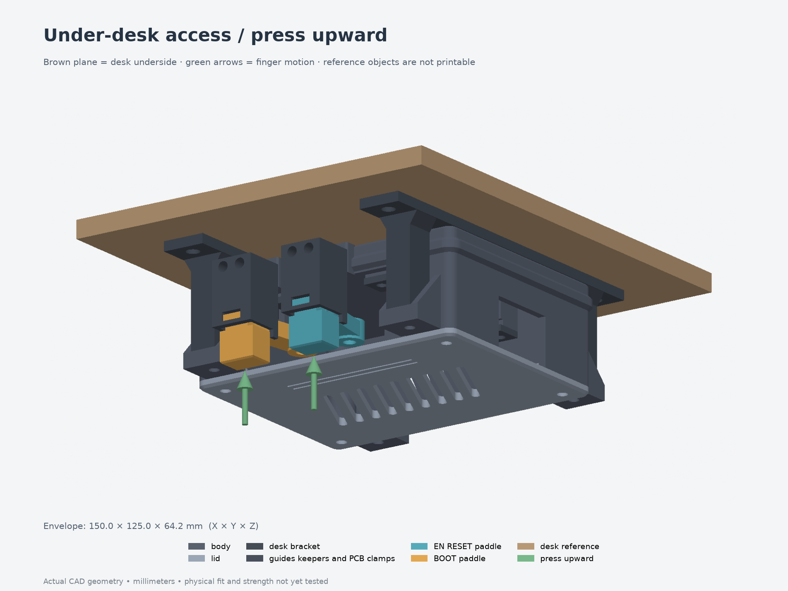

# ESP32 desk enclosure

Parametric enclosure for the pictured ESP32/perfboard controller, with console-inspired
curves, chamfers, ventilation, an under-desk bracket and external EN/RESET and BOOT
paddles. The user's [latest measurements](measurements/) separate the
**49 × 70 × 1 mm perfboard** from the **52 mm ESP32 span**. Confirmed button centers
are 30 and 16 mm from the bottom edge, each 3.3 mm from the left edge.

**Current fit test: [002 — PCB clamps with heat-set inserts](fit-tests/002-board-fit-heatsets/).**
It corrects the board retention dimensions and keeps all screws outside the PCB.
The user ruled out direct fastening through the small PCB holes.

**Latest full enclosure: [005 — downward-facing buttons](revisions/005-downward-buttons/).**
This archived full model still uses the earlier 52 mm board-retention assumption.
Its clamps cannot capture the corrected 49 mm substrate; the measured button
spacing also needs an actuator layout revision. Use the new fit test for this board.
The enclosure mounts with its lid facing the floor. **Press the exposed pads upward.**
The pads extend 7 mm to clear the mounting ears; a new bracket lets the case slide
upward into place. Only the bracket and two sliders change from revision 004.

Revision 005 uses six **M3×5 mm heat-set inserts**: four in the desk bracket and two in the
actuator contacts. The contacts retain **M3×12 nylon screws and jam nuts**; bracket
attachment uses M3×10 screws. The four cartridge mounting inserts remain 4 mm long.



## Open or print

Use the **[corrected board-fit test](fit-tests/002-board-fit-heatsets/)** and its
[five-part 3MF](fit-tests/002-board-fit-heatsets/print-layout.3mf) to check the
49 × 70 × 1 mm board. Its four clamps use **M3×5 heat-set inserts and M3×6 screws**.
Follow its guide for insert dimensions, print orientation and physical checks.
It checks retention, underside space and lower obstructions; upper components
and the button mechanisms are outside the test.

The [first clamp fit test](fit-tests/001-board-fit/) is preserved with its original
52 mm substrate assumption and M3 nuts. It is superseded for the measured board.

The fit review identified two unresolved physical-fit concerns: narrow board-edge
support and 0.2 mm vertical PCB play. In the inverted enclosure that play can
reduce the default button idle gap from 0.6 to 0.4 mm. Set and verify the contacts
with the actual board seated against its clamps in the mounted orientation;
the idealized switch-depression value is not a measured travel limit.

For native `.f3d` files, use the included [Fusion export script](fusion/README.md)
inside Fusion on Windows or Mac. It exports the assembly and each part and checks
the archives after reopening. The native conversion is pending a Fusion run;
the script does not recreate the Python model's feature history.

- [Assembly STEP](revisions/005-downward-buttons/assembly.step): 15 printable solids in
  assembly position; open/import in Fusion 360 or FreeCAD. STEP preserves the
  solid geometry. The editable parametric master is Python, not a Fusion timeline.
- [Individual STEP and 3MF parts](revisions/005-downward-buttons/parts/): editable solids
  and meshes, oriented for printing.
- [Print-layout 3MF](revisions/005-downward-buttons/print-layout.3mf): geometry in
  millimeters, without a printer or filament profile. Arrange parts for your bed.
- [Button cutaway](revisions/005-downward-buttons/button-mechanism.png),
  [interior](revisions/005-downward-buttons/interior.png),
  [exploded view](revisions/005-downward-buttons/exploded.png), and
  [hardware STEP](revisions/005-downward-buttons/hardware-reference.step).
- [Assembly, hardware and design notes](revisions/005-downward-buttons/design-notes.md).

The printed assembly is **116.8 × 95.2 × 39.6 mm**. Hardware, the desk and direction
arrows are excluded from the printable files. The hardware STEP contains simplified
cartridge hardware and bracket inserts; threads and other shell hardware are omitted.

## Preserved revisions

| Revision | Design |
| --- | --- |
| [001-generic](revisions/001-generic/) | Original rectangular enclosure and desk bracket |
| [002-console](revisions/002-console/) | Approved rounded/chamfered shell, diagonal vents and recessed lid detail |
| [003-buttons](revisions/003-buttons/) | External magnetic-return paddles with captive nylon contact nuts |
| [004-heatsets](revisions/004-heatsets/) | M3×5 contact inserts, M3×12 contact screws and local USB-clearance relief |
| [005-downward-buttons](revisions/005-downward-buttons/) | Inverted case, extended finger pads and straight bracket legs with M3×5 inserts |

Revisions 001–004 are preserved byte-for-byte; the checksum manifest covers 171 files.
Their archived notes/reports contain historical workstation paths and references
to ZIP bundles; use the portable commands below. ZIP duplicates and reference
photos are not required to regenerate this numerical model and are omitted.

## Rebuild

The **[published skills and workflow overview](skills/README.md)** includes portable
copies of the FDM CAD and mesh-editing skills used with this workbench, plus links
to the shared builder, mesh checks, FreeCAD inspection and Fusion export helper.

The package uses build123d/OpenCascade for CAD, Trimesh for mesh checks and CPU
rendering for previews. It includes the source utilities and `uv.lock`; no
workstation-specific CAD installation is needed for the main Python build.

From this directory, with `uv` installed:

```bash
uv sync --locked
uv run --locked python revisions/005-downward-buttons/build-revision.py --output builds/check
uv run --locked python builds/check/render-details.py builds/check
uv run --locked python scripts/check-flipped-mount.py --source builds/check \
  --baseline revisions/004-heatsets \
  --output builds/check/integration-validation.json
uv run --locked python -m pytest -q
uv run --locked python scripts/verify-archives.py
```

The lockfile selects Python 3.13 and pinned CAD/mesh dependencies. The builder
requires a **new output directory** so it cannot overwrite an archived revision.
To change dimensions, copy `revisions/005-downward-buttons/parameters.json`, edit it, and
pass `--params your-parameters.json` with a new `--output` directory. Keep
`model.py`, `base_model.py`, `button_module.py`, `mounting.py` and the build/render helpers together;
the builder snapshots their source and hashes into every build.

`validation.json` records solid validity, STEP and 3MF read-back, mesh checks,
dimensions, print orientation and assembly interference. Validation reports in
the revision directory document the additional mechanism checks.

The revision's reports cover STEP/3MF read-back, independent FreeCAD inspection,
button travel, centered fingertip clearance, bracket hardware and vertical case
installation. Archived integration reports record source hashes and original test
paths; the command above uses package-relative inputs. The shared workflow tests
also pass. Portability has been exercised on Linux x86_64; other platforms and
native Fusion conversion have not been tested here.

For optional independent STEP inspection, run
`scripts/check-freecad.py <fresh-build-directory>` with a Python interpreter that
can import FreeCAD and Part. It writes an imported `inspection.FCStd` and a
comparison report into that build directory. The supplied archived inspection
files were checked with FreeCAD 1.1.3; they are imported geometry, not native
sketch/feature histories. No local FreeCAD launcher or binary is bundled.

## Printing and fit

Unfilled PETG is the initial material candidate. Print the body floor-down, the
lid exterior-down and the bracket desk-contact-face down. Cartridge frames and
rear keepers print on their outer sides; sliders need local removable support
under their stepped arms. The extended pads increase the needed support height.
Keep guide and magnet seats free of support scars.
Review the short shell bridges in the slicer. No supports are modeled.

The six bracket/contact inserts are modeled as **5 mm long, 4.6 mm outside diameter**
with a **4.0 mm pilot**. M3×5 specifies thread and length, not outside diameter;
the diameter/pilot are provisional parameters until the actual insert is known.
Check a material-specific insert and guide-fit coupon before printing the full
set. The four cartridge mounting inserts are a different, **4 mm-long** part.

The magnet return uses two captive Ø4 × 2 mm magnets per paddle, with like poles
facing. Return force, physical switch travel, connector fit, thermal behavior,
RF performance and mounting strength have not been tested. Set contact height
and travel to release the switch at rest and prevent overpressing. The model
assumes only the low-voltage controller is enclosed; the external PSU is separate.
