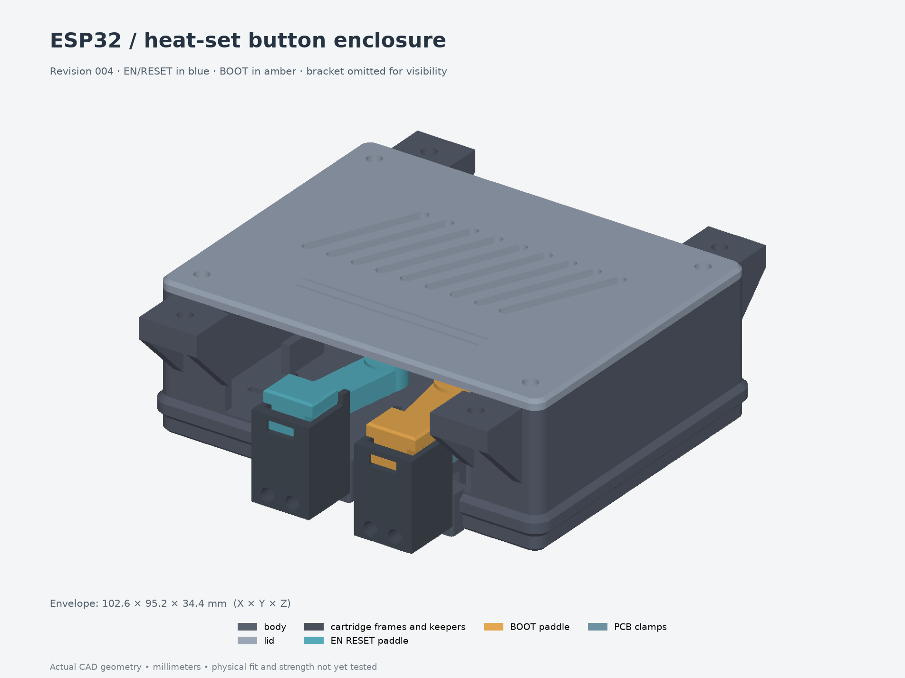

# ESP32 desk enclosure

Parametric enclosure for the pictured ESP32/perfboard controller, with console-inspired
curves, chamfers, ventilation, an under-desk bracket and external EN/RESET and BOOT
paddles. The board envelope is provisionally **52 × 70 mm**; the user's estimated
15 mm electronics height and the photo-derived connector/button positions still
need measurement.

**Current revision: [004 — heat-set button contacts](revisions/004-heatsets/).**
Each paddle now uses an **M3×5 mm heat-set insert and an M3×12 nylon contact screw**
with a nylon jam nut. This replaces the actuator's embedded nut. The shell nuts
and the cartridges' separate 4 mm mounting inserts retain their previous design.



## Open or print

For native `.f3d` files, use the included [Fusion export script](fusion/README.md)
inside Fusion on Windows or Mac. It exports the assembly and each part and checks
the archives after reopening. The native conversion is pending a Fusion run;
the script does not recreate the Python model's feature history.

- [Assembly STEP](revisions/004-heatsets/assembly.step): 15 printable solids in
  assembly position; open/import in Fusion 360 or FreeCAD. STEP preserves the
  solid geometry. The editable parametric master is Python, not a Fusion timeline.
- [Individual STEP and 3MF parts](revisions/004-heatsets/parts/): editable solids
  and meshes, oriented for printing.
- [Print-layout 3MF](revisions/004-heatsets/print-layout.3mf): geometry in
  millimeters, without a printer or filament profile. Arrange parts for your bed.
- [Button cutaway](revisions/004-heatsets/button-mechanism.png),
  [interior](revisions/004-heatsets/interior.png),
  [exploded view](revisions/004-heatsets/exploded.png), and
  [hardware STEP](revisions/004-heatsets/hardware-reference.step).
- [Assembly, hardware and design notes](revisions/004-heatsets/design-notes.md).

The assembled envelope is **116.8 × 95.2 × 43.2 mm**. Hardware and illustrative
electronics are excluded from the printable files. The hardware STEP contains
simplified cartridge hardware only; its threads and the original shell hardware
are not modeled.

## Preserved revisions

| Revision | Design |
| --- | --- |
| [001-generic](revisions/001-generic/) | Original rectangular enclosure and desk bracket |
| [002-console](revisions/002-console/) | Approved rounded/chamfered shell, diagonal vents and recessed lid detail |
| [003-buttons](revisions/003-buttons/) | External magnetic-return paddles with captive nylon contact nuts |
| [004-heatsets](revisions/004-heatsets/) | M3×5 contact inserts, M3×12 contact screws and local USB-clearance relief |

Revisions 001–003 are byte-for-byte copies of the prior workbench artifacts.
Their archived notes/reports contain historical workstation paths and references
to ZIP bundles; use the portable commands below. ZIP duplicates and reference
photos are not required to regenerate this numerical model and are omitted.

## Rebuild

The package uses build123d/OpenCascade for CAD, Trimesh for mesh checks and CPU
rendering for previews. It includes the source utilities and `uv.lock`; no
workstation-specific CAD installation is needed for the main Python build.

From this directory, with `uv` installed:

```bash
uv sync --locked
uv run --locked python revisions/004-heatsets/build-revision.py --output builds/check
uv run --locked python builds/check/render-details.py builds/check
uv run --locked python scripts/check-heatsets.py --model-dir builds/check \
  --baseline revisions/002-console/model.py \
  --prior-module revisions/003-buttons/button_module.py \
  --output builds/check/integration-validation.json
uv run --locked python -m pytest -q
uv run --locked python scripts/verify-archives.py
```

The lockfile selects Python 3.13 and pinned CAD/mesh dependencies. The builder
requires a **new output directory** so it cannot overwrite an archived revision.
To change dimensions, copy `revisions/004-heatsets/parameters.json`, edit it, and
pass `--params your-parameters.json` with a new `--output` directory. Keep
`model.py`, `button_module.py`, `mounting.py` and the build/render helpers together;
the builder snapshots their source and hashes into every build.

`validation.json` records solid validity, STEP and 3MF read-back, mesh checks,
dimensions, print orientation and assembly interference. Validation reports in
the revision directory document the additional mechanism checks.

Revision 004 passed 992 integration checks across four parameter configurations,
all 15 parts passed STEP/3MF validation and independent FreeCAD reopening, and
a fresh build from this package reproduced the archived CAD dimensions/volumes.
The retained integration report records the checked source hashes and the
original temporary test paths; the command above uses package-relative inputs.
The five shared workflow tests also pass. Portability was exercised on Linux
x86_64; other platforms have not been tested.

For optional independent STEP inspection, run
`scripts/check-freecad.py <fresh-build-directory>` with a Python interpreter that
can import FreeCAD and Part. It writes an imported `inspection.FCStd` and a
comparison report into that build directory. The supplied archived inspection
files were checked with FreeCAD 1.1.3; they are imported geometry, not native
sketch/feature histories. No local FreeCAD launcher or binary is bundled.

## Printing and fit

Unfilled PETG is the initial material candidate. Print the body floor-down, the
lid exterior-down and the bracket desk-contact-face down. Cartridge frames and
rear keepers print on their outer sides; sliders need local removable support
under their stepped arms. Keep guide and magnet seats free of support scars.
Review the short shell bridges in the slicer. No supports are modeled.

The two actuator inserts are modeled as **5 mm long, 4.6 mm outside diameter**
with a **4.0 mm pilot**. M3×5 specifies thread and length, not outside diameter;
the diameter/pilot are provisional parameters until the actual insert is known.
Check a material-specific insert and guide-fit coupon before printing the full
set. The four cartridge mounting inserts are a different, **4 mm-long** part.

The magnet return uses two captive Ø4 × 2 mm magnets per paddle, with like poles
facing. Return force, physical switch travel, connector fit, thermal behavior,
RF performance and mounting strength have not been tested. Set contact height
and travel to release the switch at rest and prevent overpressing. The model
assumes only the low-voltage controller is enclosed; the external PSU is separate.
