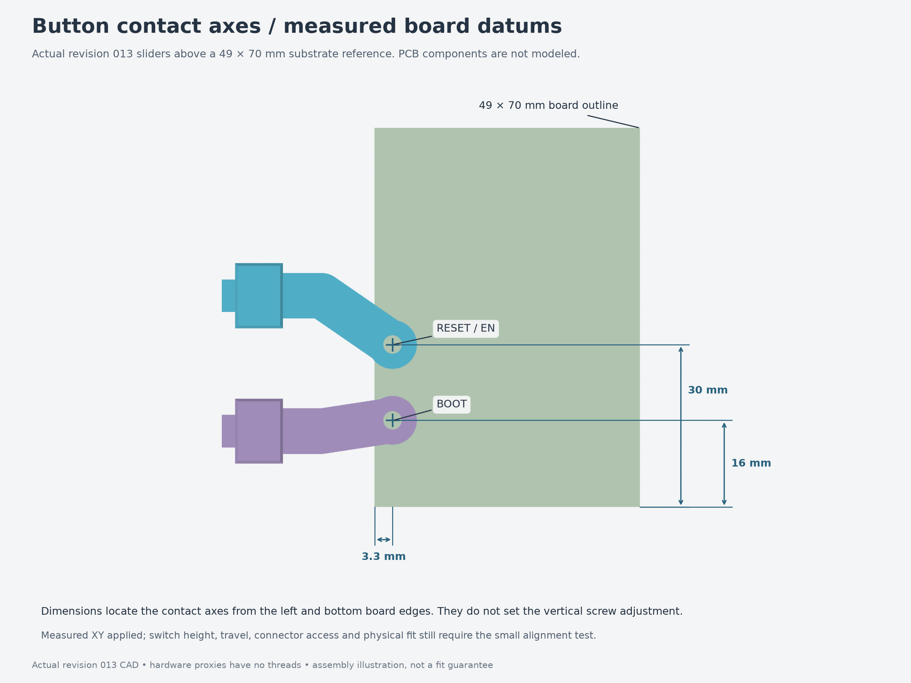

# ESP32 desk enclosure

Parametric enclosure for the pictured ESP32/perfboard controller, with console-inspired
curves, chamfers, ventilation, an under-desk bracket and external EN/RESET and BOOT
paddles. The [measurements](measurements/) distinguish the **49 × 70 × 1 mm
perfboard** from the **52 mm populated ESP32 span**.

**Latest: [013 — measured button alignment](revisions/013-measured-buttons/README.md).**
The two replacement sliders place RESET **30 mm** and BOOT **16 mm** from the
bottom board edge, both **3.3 mm from the left edge**. Their arms bend after
leaving the guides, so the exterior cartridge mounts stay in place.

**[Quick print: the two revised sliders](fit-tests/008-button-alignment/sliders-only.3mf)**,
with [fit instructions](fit-tests/008-button-alignment/README.md). Reuse the
revision 012 body, lid, bracket, four PCB clamps and six other cartridge
pieces. A [complete open test jig](fit-tests/008-button-alignment/print-layout.3mf)
is also included for testing without a full enclosure.

**[Illustrated button assembly guide](assembly-guides/013-buttons/README.md)**
covers the four printed pieces per cartridge, heat-set inserts, repelling magnet
faces, keeper installation and nylon contact adjustment. Fit the board, clamps
and USB plug before attaching the cartridges.



The CAD now implements the measured XY coordinates. Physical button alignment
still depends on PCB placement within its clearance; height/travel, magnetic
return, insert fit and USB plug dimensions need the quick test. The closer
contacts do not preserve the old 11 mm straight inner USB corridor. The
provisional 8 × 6 mm plug box also intersects a PCB clamp screw head, so fitting
the plug before the cartridges alone does not establish clearance. Test the
actual connector before completing assembly. Check lid clearance after
adjusting the contact screws. Mounted under the desk, the lid and pads face
down; press the pads upward.

Board retention and cable geometry are unchanged from 012: **50.3 mm** locating
gap, **1.3 mm** centered shelf/clamp coverage per edge, and a **1.2 mm** vertical
slot. Overall dimensions remain **114.3 × 95.2 × 39.6 mm**.
[Board test 007](fit-tests/007-board-easier-fit/README.md) and
[cable test 006](fit-tests/006-cable-cradle/README.md) remain usable. The concave
Ø8.4 mm cradle supports the measured 8 mm cable with a zip-tie passage; actual
tie dimensions and retention performance remain unverified.

## Open or print

- [Illustrated button assembly guide](assembly-guides/013-buttons/README.md):
  current printed parts, short mounting inserts, magnet polarity, keeper
  installation and nylon contact adjustment. Check actual board position,
  switch height and USB plug clearance with the quick print.
- [Assembly STEP](revisions/013-measured-buttons/assembly.step): 15 printable
  solids in assembly position; open/import in Fusion 360 or FreeCAD. The editable
  parametric master is Python, not a Fusion timeline.
- [Body 3MF](revisions/013-measured-buttons/parts/body.3mf),
  [lid 3MF](revisions/013-measured-buttons/parts/lid.3mf), and
  [desk bracket 3MF](revisions/013-measured-buttons/parts/desk_bracket.3mf).
- [Individual STEP/3MF parts](revisions/013-measured-buttons/parts/) and
  [full print-layout 3MF](revisions/013-measured-buttons/print-layout.3mf).
- [Cable/tie routing](revisions/013-measured-buttons/cable-routing.png),
  [lid clearance](revisions/013-measured-buttons/cable-closure.png),
  [mounted view](revisions/013-measured-buttons/under-desk.png), and
  [interior](revisions/013-measured-buttons/interior.png).
- [Revision guide](revisions/013-measured-buttons/README.md) and
  [design/validation notes](revisions/013-measured-buttons/design-notes.md).

These files carry geometry in millimeters, without verified printer or filament
profiles. Reference electronics/cable/tie/desk solids are excluded from printing.
The separate hardware STEP contains 34 simplified proxies and is not a complete
fastener assembly. Physical fit, load capacity and material behavior remain untested.

For native `.f3d` files, run the included [Fusion export script](fusion/README.md)
inside Fusion on Windows or Mac. Native conversion is pending a Fusion run; it
does not recreate the Python model's feature history.

## Preserved revisions

| Revision | Design |
| --- | --- |
| [001-generic](revisions/001-generic/) | Original rectangular enclosure and desk bracket |
| [002-console](revisions/002-console/) | Approved rounded/chamfered shell, diagonal vents and recessed lid detail |
| [003-buttons](revisions/003-buttons/) | External magnetic-return paddles with captive nylon contact nuts |
| [004-heatsets](revisions/004-heatsets/) | M3×5 contact inserts, M3×12 contact screws and local USB-clearance relief |
| [005-downward-buttons](revisions/005-downward-buttons/) | Inverted case, extended finger pads and straight bracket legs with M3×5 inserts |
| [006-lid-heatsets](revisions/006-lid-heatsets/) | Four lid nut pockets replaced by M3×5 inserts and M3×8 screws; only the body changes, retaining compatibility with the other revision 005 parts |
| [007-pcb-heatsets](revisions/007-pcb-heatsets/) | Four PCB-clamp nut pockets replaced by M3×5 inserts and M3×6 screws; body and four clamps change, retaining compatibility with the other ten revision 006 parts |
| [008-corner-bosses](revisions/008-corner-bosses/) | Full-height lid posts replaced by short corner pads and 45° wall ribs, with matching lid-skirt clearance; body and lid change, retaining compatibility with the other thirteen revision 007 parts |
| [009-cable-retention](revisions/009-cable-retention/) | Rounded cable support with a zip-tie passage at the end opening; only the body changes from revision 008, accompanied by a small exact-geometry fit test |
| [010-8mm-cable](revisions/010-8mm-cable/) | Records the measured 8 mm cable, updates clearance references and the quick test; all fifteen printed parts remain unchanged from revision 009 |
| [011-fit-and-cable-cradle](revisions/011-fit-and-cable-cradle/) | Full body/lid/bracket width reduced 3 mm, measured 49 × 70 × 1 mm PCB capture, concave cylindrical cable seat and two exact-geometry fit tests |
| [012-easier-board-fit](revisions/012-easier-board-fit/) | Adds 0.5 mm total fit width, 0.5 mm deeper shelf/clamp coverage per edge, matching slider arms and exact board test 007; cable coupon 006 remains usable |
| [013-measured-buttons](revisions/013-measured-buttons/) | Two dogleg sliders reach the measured 30/16 mm bottom offsets and 3.3 mm left inset; thirteen other printed parts are unchanged from012 |


Revisions 001–012 are preserved unchanged. The original checksum manifest covers
171 files in revisions 001–004; the lid-joint checks compare revision 006 with 005.
The PCB-clamp checks compare revision 007 with 006; the corner-boss checks compare
revision 008 with 007. The cable-retention checks compare revision 009 with 008; the measured-cable
checks confirm unchanged printed geometry and the 8 mm clearance in revision 010.
Revision 011 separately checks the width reduction, exact board/cable coupons,
concave geometry and clearance variant, button travel and bracket installation.
Its width comparison confirms twelve reusable printed shapes; both new test
prints and the full export also pass independent FreeCAD reopening.
Revision 012 checks the added fit width, deeper support strips, matching clamps,
slider arms, nominal/variant mechanism paths and the exact new board coupon.
Its previous cable coupon remains unchanged; see the new revision guide for
complete regeneration and fit-check commands.
Revision 013 checks measured tip axes, independent button states, cartridge
assembly and service paths, retained geometry, and provisional USB envelopes;
its quick test includes the actual two replacement sliders.
Their archived notes/reports contain historical workstation paths and references
to ZIP bundles; use the portable commands below. ZIP duplicates and reference
photos are not required to regenerate this numerical model and are omitted.

## Rebuild

The **[published skills and workflow overview](skills/README.md)** includes portable
copies of the FDM CAD and mesh-editing skills used with this workbench, plus links
to the shared builder, mesh checks, FreeCAD inspection and Fusion export helper.

The package uses build123d/OpenCascade for CAD, Trimesh for mesh checks and CPU
rendering for previews. It includes the source utilities and `uv.lock`; no
workstation-specific CAD installation is needed for the main Python build.

From this directory, with `uv` installed:

```bash
uv sync --locked
uv run --locked python revisions/013-measured-buttons/build-revision.py --output builds/check
uv run --locked python builds/check/render-details.py builds/check
uv run --locked python scripts/check-measured-button-alignment.py --source builds/check \
  --baseline revisions/012-easier-board-fit --output builds/check/mechanism-validation.json
uv run --locked python -m pytest -q
uv run --locked python scripts/verify-archives.py
```

The lockfile selects Python 3.13 and pinned CAD/mesh dependencies. The builder
requires a **new output directory** so it cannot overwrite an archived revision.
To change dimensions, copy `revisions/013-measured-buttons/parameters.json`, edit it, and
pass `--params your-parameters.json` with a new `--output` directory. Keep
`model.py`, `base_model.py`, `button_module.py`, `mounting.py` and the build/render helpers together;
the builder snapshots their source and hashes into every build.

`validation.json` records solid validity, STEP and 3MF read-back, mesh checks,
dimensions, print orientation and assembly interference. Validation reports in
the revision directory document the additional mechanism checks.

The revision 008 reports cover STEP/3MF read-back, independent FreeCAD inspection,
corner-pad and rib geometry, lid clearance, insert/screw fit and preservation of
the other thirteen printed parts. Revision 007 retains its PCB-joint checks and
revision 006 its lid-joint checks. Revision 005 retains its button-travel, fingertip,
bracket and case-installation checks. Archived reports record source hashes and
original test paths; the command above uses package-relative inputs. The shared workflow tests
also pass. Portability has been exercised on Linux x86_64; other platforms and
native Fusion conversion have not been tested here.

For optional independent STEP inspection, run
`scripts/check-freecad.py <fresh-build-directory>` with a Python interpreter that
can import FreeCAD and Part. It writes an imported `inspection.FCStd` and a
comparison report into that build directory. The supplied archived inspection
files were checked with FreeCAD 1.1.3; they are imported geometry, not native
sketch/feature histories. No local FreeCAD launcher or binary is bundled.

## Printing and fit

Unfilled PETG is the initial material candidate. Print the body floor-down, the
lid exterior-down and the bracket desk-contact-face down. Cartridge frames and
rear keepers print on their outer sides; sliders need local removable support
under their stepped arms. The extended pads increase the needed support height.
Keep guide and magnet seats free of support scars.
Review the short shell bridges in the slicer. No supports are modeled.
The new lid pads grow from paired 45° wall ribs; inspect that region in the slicer
along with the trimmed lid skirt. Any CAD volume reduction is a solid-geometry
comparison; print time and filament savings require a sliced comparison.

The fourteen PCB/lid/bracket/contact inserts are modeled as **5 mm long, 4.6 mm outside diameter**
with a **4.0 mm pilot**. M3×5 specifies thread and length, not outside diameter;
the diameter/pilot are provisional parameters until the actual insert is known.
Check a material-specific insert and guide-fit coupon before printing the full
set. The four cartridge mounting inserts are a different, **4 mm-long** part.
The lid pilots are **6 mm deep**. M3×8 screws through the unchanged 2.4 mm lid
give 5 mm nominal insert engagement and 0.4 mm blind-tip clearance. Install these
four inserts flush from the open body rim before fitting the lid.
The pads project 8.4 mm into the cavity and overlap each wall by 0.4 mm. They are
8 mm tall, with 2 mm of material below the blind pilots; their paired ribs start
8.4 mm below the pads. These dimensions describe the nominal geometry and do not
establish the joint's physical load capacity.
The four PCB-clamp pilots are also **6 mm deep**. Their M3×6 screws give 4 mm
nominal engagement and 2 mm blind-tip clearance. Install the inserts flush with
the boss tops before placing the PCB and clamps. These screws capture the board
edges without passing through the PCB.

The magnet return uses two captive Ø4 × 2 mm magnets per paddle, with like poles
facing. Return force, physical switch travel, connector fit, thermal behavior,
RF performance and mounting strength have not been tested. Set contact height
and travel to release the switch at rest and prevent overpressing. The model
assumes only the low-voltage controller is enclosed; the external PSU is separate.
