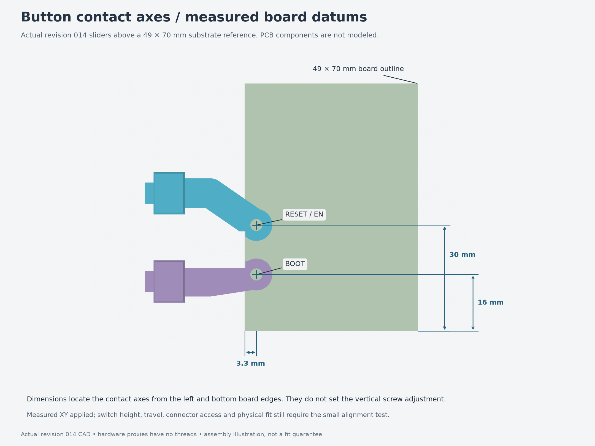
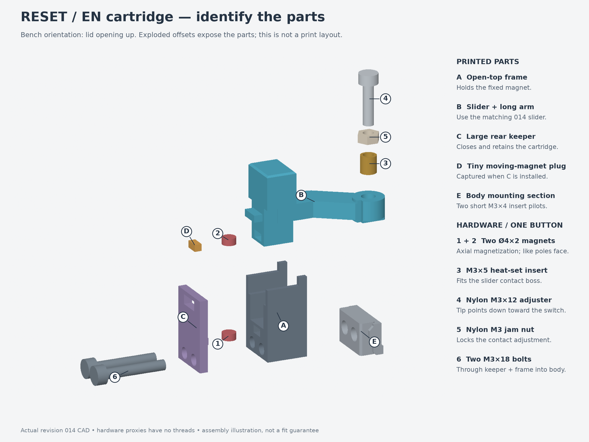
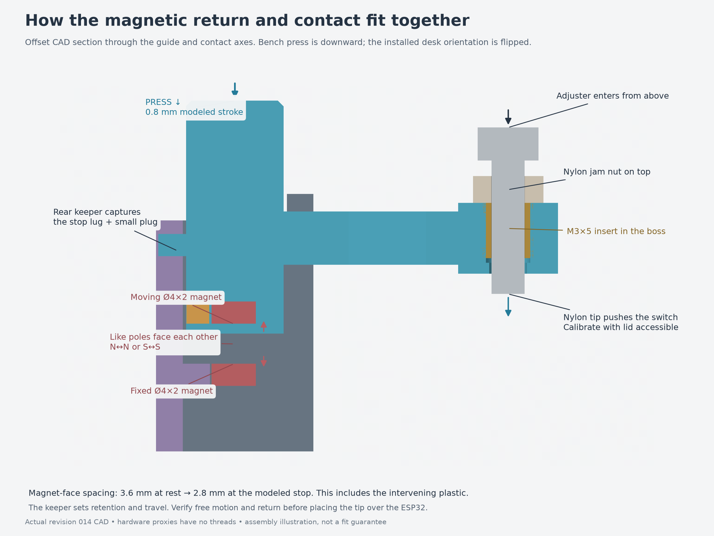
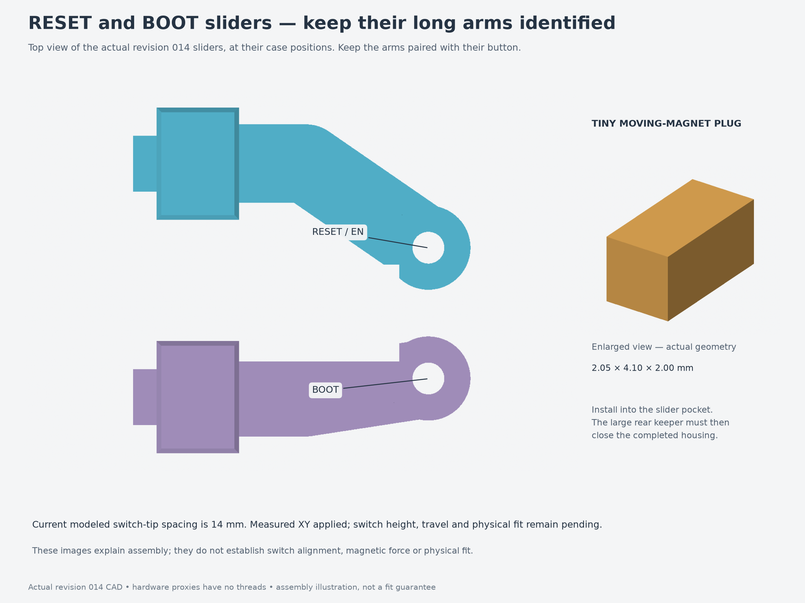

# Revision 014 button and USB assembly

Assembly of the external magnetic-return **EN/RESET and BOOT paddles** for
[revision 014](../../revisions/014-usb-clearance/README.md). Each paddle moves
a nylon screw onto its ESP32 switch; two repelling magnets return the paddle
when released.

**Use revision 014's RESET slider, BOOT slider and BOOT frame.** The other twelve
printed pieces and removable hardware can be reused from revision 013; fit two
M3×5 contact inserts in the replacement sliders. The contact axes
remain RESET **30 mm** and BOOT **16 mm** from the perfboard bottom, both
**3.3 mm from its left edge**.

Start with the [three-piece quick print](../../fit-tests/009-usb-clearance/replacements-only.3mf)
and [fit instructions](../../fit-tests/009-usb-clearance/README.md).
The board-position allowance, actual switch height/travel and magnetic return
still need physical testing. Screw height cannot correct a sideways offset.

Your USB measurements are **10 mm wide, 6 mm thick and 20 mm projecting past
the left board edge**. Its underside is **9 mm above the perfboard**, so its top
is **15 mm above it**. The USB center is **23 mm from the bottom edge** and the
flexible cable is **Ø3.5 mm**. The measured height clears the adjacent PCB clamp
screw head by 3.8 mm in the model; it supersedes revision 013's provisional
plug/screw conflict.

The revised arms and BOOT rail clear the centered conservative plug box with
0.2 mm nominal allowance throughout button travel. Board movement within the
retainers can consume that clearance. The real plug taper, inboard jack and
cable bend remain unmodeled; test the actual assembly before a full print.




## Orientation

For assembly, put the **body floor on the bench, lid removed, open side up**.
“Up” and “down” below refer to that position. The slider's arm points inward
toward the board; the rear keeper and mounting screw heads face outward.

On the bench, press the finger pad **down toward the body floor**. Mounted under
the desk, the enclosure is inverted: the lid and exposed pads face down, and
you press the pads **up toward the desk**.

## Parts and hardware

Use the [revision 014 printable parts](../../revisions/014-usb-clearance/parts/).
The RESET and BOOT sliders have different arms: keep each with its named set.
The revision 014 sliders have open-bottom USB reliefs, and the BOOT frame has
a relieved upper inner guide. Reuse the RESET frame and both pairs of keepers
from revision 013.

| Item | Per button | Both buttons | Where it goes |
| --- | ---: | ---: | --- |
| Printed frame | 1 | 2 | Stationary U-shaped slider guide |
| Printed slider | 1 | 2 | Finger pad, arm and round contact boss |
| Printed rear keeper | 1 | 2 | Large outside plate with a tongue and lug window |
| Printed moving-magnet keeper | 1 | 2 | Tiny rectangular plug in the slider |
| Axially magnetized Ø4 × 2 mm disc magnet | 2 | 4 | One fixed in the frame, one in the slider |
| M3 × 18 socket-head screw | 2 | 4 | Through rear keeper and frame into body pads; head diameter ≤5.5 mm |
| **M3 × 4 mm heat-set insert** | 2 | 4 | Short inserts in the exterior body mounting pads |
| **M3 × 5 mm heat-set insert** | 1 | 2 | Round contact boss at the end of the slider arm |
| Nylon M3 × 12 screw | 1 | 2 | Adjustable contact tip |
| Nylon M3 jam nut | 1 | 2 | Locks the contact adjustment above the boss |

These quantities cover the buttons only. The nylon jam nut is an exposed
adjustment lock; there is **no captive nut pocket** in this contact joint.

**Do not swap the two insert lengths.** The body cartridge-mount pilots are
only 4.4 mm deep and take the short 4 mm inserts. The contact boss takes the
5 mm insert. Both currently assume a 4.6 mm insert outside diameter and a
4.0 mm pilot: check your actual inserts, since “M3 × 5” does not specify the
outside diameter.



## Assembly order

1. **Clean the printed parts and fit the inserts.** Remove support remnants
   and burrs from the guides, magnet pockets and screw passages. With the
   electronics and magnets absent, install the two short body inserts
   horizontally from outside toward the board. Install the contact insert
   downward into the top of the slider's round boss. Seat all inserts square
   and flush, let them cool, and check that the nylon screw threads smoothly
   through the insert and its tip clears the boss's through-hole. Keep heat and
   displaced plastic out of the sliding surfaces.

2. **Dry-fit the slider, then fit the board, clamps and USB plug.** With the rear keeper
   off, lower the slider vertically into the open U-guide. The arm remains
   pointed inward; it does not thread through a narrow rear window. Check
   smooth movement, then remove the slider for magnet installation. Install
   the PCB and its edge clamps before attaching the cartridges: the BOOT arm
   obstructs access to the left-front PCB clamp screw. Fit the USB plug before
   the cartridges as well: the retained exterior housings can obstruct a
   straight plug insertion path. Check your actual plug and cable throughout
   button travel. Leave the nylon contact
   screws out until the cartridges are installed and alignment is checked.

3. **Identify the repelling magnet faces.** Each disc's two flat faces are its
   poles. Find a pair of faces that repel and mark those facing surfaces.
   In the bench orientation, the fixed magnet's **upper face** and the moving
   magnet's **lower face** must have the same pole: N facing N or S facing S.
   Marking the same pole and putting both marked faces upward would make the
   facing poles attract.

4. **Load the magnets and tiny keeper.** Slide the fixed disc through the
   frame's open outside/rear channel into its pocket. Slide the moving disc
   into the slider's rear pocket, then insert the tiny rectangular
   moving-magnet keeper behind it. The discs sit with their flat faces
   horizontal. Hold the tiny keeper in place until the large rear keeper is
   fitted and bolted; the completed housing captures the tiny plug. The magnets
   are mechanically retained when assembled; adhesive is not part of this design.

5. **Place the bare frame, then lower its loaded slider.** With the board,
   clamps and USB plug already installed, bring the frame inward horizontally
   against the body's exterior mounting pads and hold it there. Keep the large
   rear keeper off. Lower the loaded slider vertically into the U-guide, arm
   inward, keeping its tiny keeper seated. The relief opens downward so it can
   pass around the plugged-in USB body. Do not bring a preassembled cartridge
   horizontally over the plug: its contact boss can sweep through the plug.

6. **Close the rear and secure the cartridge.** Fit the large rear keeper from
   outside. Its tongue closes the fixed-magnet channel and its window captures
   the slider's rear stop lug. If it will not sit flush, check the tongue,
   magnet and lug positions before tightening anything. Insert both M3 × 18
   screws from outside through the rear keeper and frame into the short body
   inserts. Snug evenly, then check smooth travel and free return. These screws
   secure both the frame and rear keeper; the modeled joint assumes no washers.
   Repeat with the other button's named parts. Leave the contact screws out
   until the arms align with the actual switches.

7. **Install the nylon contact adjuster after checking alignment.** Thread the
   nylon jam nut onto the nylon screw first. Feed the screw **from above the
   round boss**, through its insert, with the tip pointing down toward the
   switch. The screw head and jam nut stay on the lid side of the boss. After
   setting the contact height, hold the screw still and snug the jam nut
   against the boss to lock the setting. Use the nylon tip specified here.



## Setting and testing the contacts

First confirm that each tip is centered over its actual switch and that the
board is held securely by the shelves and clamps. Center it and check both
tips together before using a contact screw to press a switch. Check available
board movement as described in the quick-test instructions.

- At rest, the switch must be fully released, with clearance under the tip.
- Press slowly. The switch should actuate reliably, then the **printed slider
  stops** must limit travel before the switch is overloaded. The switch itself
  must not serve as the mechanical stop.
- Release the pad. It must return freely and fully release the switch. Test
  each button separately, then recheck after locking its jam nut.
- Close the lid gently and check screw-head clearance. The current nominal
  model has only **0.4 mm** above the adjuster head; backing the screw out
  raises the head and can make it hit the lid. Check your actual head and nut
  sizes. Do not force the lid closed against an adjuster.
- Repeat with the enclosure inverted in its intended under-desk orientation,
  before fastening it to the desk. The PCB has 0.2 mm nominal vertical play;
  check it seated against the retaining clamps as it will be when mounted.

The model uses 0.8 mm slider travel, a 0.6 mm rest gap and 0.2 mm switch
depression. These are **CAD assumptions, not measured switch settings**.
Magnetic return force, friction and physical switch travel still need testing.
If release, actuation, printed-stop protection and lid clearance cannot all be
achieved, revise the geometry or adjustment range before continuing.

## Recognizing the pieces and servicing



If a pad sticks, check support scars, guide fit and keeper seating. If it pulls
toward the fixed magnet instead of returning, check the facing poles. Neither
problem is corrected by tightening the mounting screws harder.

To service a cartridge with the USB plug installed, reverse the assembly path.
Support the frame and slider, remove both mounting screws and the rear keeper,
then lift the slider vertically before withdrawing the bare frame horizontally.
Contain the two small magnets and tiny keeper as the rear opens. Do not pull a
fully assembled cartridge horizontally across the plug. Remove the BOOT
cartridge first when access to the left-front PCB clamp screw is needed.

## Diagram source

The diagrams show revision 014 CAD shapes, including the extended finger pads,
revised arms and USB reliefs. The translucent USB box is a conservative clearance
reference at the centered board position, not a reconstruction of the plug taper. Hardware is represented by simplified CAD
proxies. Exploded positions and section cuts are for illustration; these are
not additional printable parts.

The accompanying [render script](render-guide.py) regenerates the diagrams
from the preserved revision source. See its [source manifest](source-manifest.json)
for input hashes. From the package root:

```bash
uv run --locked python assembly-guides/014-buttons/render-guide.py \
  --source revisions/014-usb-clearance --output assembly-guides/014-buttons
```
