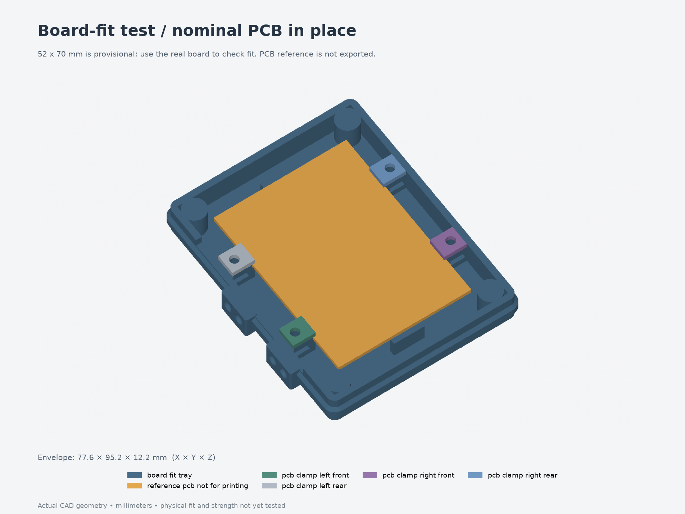

# Board-fit test for revision 005

Print **[print-layout.3mf](print-layout.3mf)**: one short tray and four small PCB
clamps. For an initial drop-in check, print just **[board_fit_tray.3mf](parts/board_fit_tray.3mf)**.
The four clamps are the same parts used in the full enclosure and can be reused.



The tray measures **77.6 × 95.2 × 12.2 mm**. Its floor, PCB ledges, stop shoulders,
nut pockets and lower connector obstructions are an exact slice of the current
production body. The full 2.4 mm floor is retained so solder-to-floor clearance
can be tested everywhere beneath the board, away from the support strips.
The orange reference PCB is only in the preview; it is absent from printable files.
The current enclosure and earlier revisions are unchanged.

## Slice and assemble

Use millimeters, **100% scale**, and the supplied floor-down/flat orientations.
Use the same filament and XY compensation planned for the enclosure. A PLA bench
trial can establish layout, but does not establish the fit of a later PETG print.
For a 0.4 mm nozzle, a starting point is 0.2 mm layers, three perimeters,
four top/bottom layers and 15% infill. These are suggested, untested settings;
the 3MF contains geometry, not a printer profile or G-code.

Begin with supports off. Inspect the short nut-pocket bridges and horizontal
cartridge pilot holes in your slicer; keep support material out of the nut entries.
There are no modeled supports. Print time and filament use depend on your slicer.
The test has 29.74 cm³ of CAD solid volume, 69.4% less than the complete 15-part
set; this is not a measured filament or time saving.

The retention test needs **four M3×8 screws and four standard M3 hex nuts**
(assumed 5.5 mm across flats, 2.4 mm tall). PCB clamps retain the production
nut pockets; no heat-set inserts, magnets or button parts are needed here.

1. Disconnect power. Check the printed tray for warping and clear the nut entries.
2. Insert the four nuts through the side entries on the PCB support blocks.
   Entries face −Y, away from the cable/zip-tie end.
3. Lower the real board into the tray, component-side up. USB/DC and button side
   faces the long open edge with two projecting cartridge pads. The terminal
   end faces the four small zip-tie slots in the floor.
4. Check seating and underside clearance before fitting the clamps. Fit all four
   clamps with M3×8 screws, tightening against their printed shoulders without
   forcing the PCB flat.
5. Gently check sideways/endways movement. Hold it over a padded surface and turn
   it over to test retention in the final mounting orientation.

## What to check

| Check | Nominal model / useful observation |
| --- | --- |
| PCB width and length | Assumed 52 × 70 mm. Stop opening is **52.8 × 70.8 mm**, even though the main cavity is larger. Record actual dimensions. |
| Thickness | Assumed 1.6 mm PCB in a **1.8 mm slot**. Check for rocking, binding or excess vertical movement. |
| Underside | **6 mm** from PCB underside to floor, except at the intentional board support strips. Solder joints and wires must clear the floor. |
| Edge support | Four 8 mm-long contact regions, centered 17 mm either side of the board's length midpoint. Both PCB faces need bare material here. Nominal edge overlap is 0.8 mm. |
| Retention | At full lateral play the opposite supports overlap only **0.4 mm**; the near supports contact up to **1.2 mm** of the edge. A board only 51.6 mm wide could lose the opposite supports at its sideways stop. |
| Lower plugs | Try the real USB/DC plugs. The left sill is 0.6 mm above the nominal PCB underside, and exterior cartridge pads rise another 0.3 mm. Record any contact and its location. |
| Clamp hardware | Screws should reach the nuts without forcing them. Model checks give 2.4 mm nut engagement and **1.8 mm screw-tip clearance** above the floor. |

Record printer/nozzle, filament, layer height, XY compensation, actual PCB
width/length/thickness, underside protrusion, and where anything catches.
Note whether a clamp contacts a component, pad, solder joint or header rather
than bare PCB. Do not enlarge the whole enclosure merely to clear one local item;
use the observations to update the relevant retained interface.

## Issues found and limits

The narrow support overlap makes the estimated board width consequential.
A loose fit is not automatically acceptable: check that the PCB stays captured
at both lateral limits when inverted.

**Board movement affects button calibration.** The nominal 0.2 mm vertical play
lets the PCB settle against the clamps when the enclosure is flipped. With the
existing contact-tip positions, the modeled idle gap falls from 0.6 to 0.4 mm,
and full-stroke geometric depression rises from 0.2 to 0.4 mm. Set and verify the
contacts with the retained board resting against its clamps in the mounted
orientation. Actual switch travel remains unmeasured. This coupon contains no
actuators and does not prove their alignment or safe travel.

Only 2.2 mm of tray remains above the nominal PCB top. A successful test does
**not** verify the 15 mm populated-board height, upper wiring, lid, complete plug
corridor, button mechanism, desk mount or end cable outlet. The production end
cable outlet starts at Z16 mm, above this tray. Physical fit is still untested.

## Validation and rebuild

- [validation.json](validation.json): five valid single-solid parts, STEP/3MF
  read-back, dimensions/units, watertight meshes, separate print objects and
  no printed-part assembly overlaps.
- [fit-validation.json](fit-validation.json): comparison with the production
  STEP body slice and four unchanged clamps; PCB insertion/play samples;
  rejection of oversize/thick reference boards; underside, nut-entry,
  screw and driver checks; a regenerated 56 × 78 mm board variant.
- [freecad-validation.json](freecad-validation.json) and
  [inspection.FCStd](inspection.FCStd): independent STEP inspection in FreeCAD.
- [assembly.step](assembly.step), [individual STEP/3MF](parts/),
  [source](model.py), [parameters](parameters.json) and
  [frozen-source hashes](source-files.json).

The source copies under `enclosure/` preserve the revision 005 generator and its
parameters. `parameters.json` wraps those dimensions with one fit-test option;
`extra_height_above_clamps` defaults to zero. Use `build-test.py` to preserve the
required source files, rather than the bare shared build command.

From `Models/ESP32Enclosure`, using its locked environment:

```bash
uv sync --locked
uv run --locked python fit-tests/001-board-fit/build-test.py --output builds/board-fit-check
uv run --locked python builds/board-fit-check/check-fit.py \
  --baseline revisions/005-downward-buttons \
  --output builds/board-fit-check/fit-validation.json
```

Choose a fresh output directory. To try other dimensions, copy `parameters.json`,
edit its `enclosure` values and pass `--params your-parameters.json` to the builder.
The production STEP comparison in `check-fit.py` requires a baseline generated
with matching enclosure parameters; the supplied baseline validates this saved test.
Run `scripts/check-freecad.py <output>` separately with a Python runtime that can
import FreeCAD if you also want the independent inspection document.
