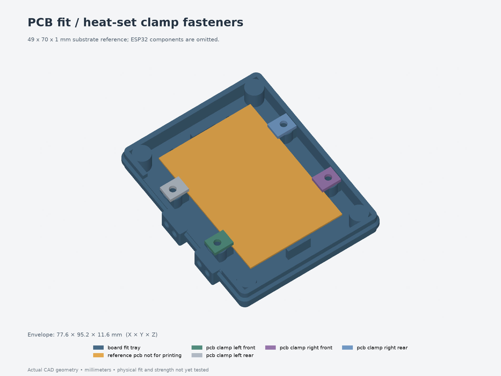

# Corrected board-fit test: heat-set clamp fasteners

Print **[print-layout.3mf](print-layout.3mf)** for the measured **49 × 70 × 1 mm
perfboard**. It contains one **77.6 × 95.2 × 11.6 mm tray** and four updated clamps.
For a first drop-in check, use [the tray alone](parts/board_fit_tray.3mf).



The four clamps now fasten into **M3×5 heat-set inserts in the tray**. Screws stay
outside the PCB, so the small board holes are unused. The old tray and clamps
remain in [fit test 001](../001-board-fit/); print the new clamps with this tray.

The 49 mm substrate and 52 mm ESP32 span are separate dimensions. The original
68 × 88 mm main cavity is retained, while the locating opening becomes
**49.8 × 70.8 mm**, and the thickness slot becomes **1.2 mm**. The exact ESP32
overhang and its height above the clamp strips still require a physical check.
The flat orange PCB shown in the preview is not included in printable files.

## Print and hardware

- Print one tray floor-down and four clamps flat, at **100% scale** in millimeters.
- Use the intended enclosure filament and XY compensation. Unfilled PETG remains
  the initial enclosure candidate; a PLA layout trial does not establish PETG fit.
- For a 0.4 mm nozzle, suggested starting settings are 0.2 mm layers, three
  perimeters, four top/bottom layers and 15% infill. These settings have not been
  sliced or printed here; the 3MF is geometry, not a printer profile or G-code.
- Start with supports off and review the four empty horizontal cartridge pilots
  in the slicer. The PCB insert bores face upward and are open. No supports are modeled.
- Use **four M3×5 inserts and four M3×6 socket-head screws**, with no washers in
  the checked stack. Head envelopes are Ø5.5 × 3 mm. The previous M3×8 clamp screws
  would reach the blind-hole bottom and must not be substituted.

The insert geometry assumes **4.6 mm outside diameter**, a **4.0 mm pilot** and a
**6.0 mm blind depth**. M3×5 specifies thread size and insert length, not outside
diameter. Check your actual inserts; adjust the exposed parameters if they differ.
Each Ø9.2 mm boss retains 2.3 mm radial plastic outside the insert envelope. The
blind bore leaves the full 2.4 mm floor plus 1.2 mm of plastic above it.

At the modeled seating positions, each screw engages **4 mm** of insert and has
**2 mm** clearance above the blind-hole bottom. These are geometry checks, not
a tightening torque or pullout-strength rating. The printed solid volume is
29.875 cm³; print time and filament use depend on your slicing settings.

## Fit procedure

1. With the board removed, heat-set the **four upward-facing PCB-clamp inserts**
   flush with their support tops. Follow your insert supplier's installation
   guidance and let the tray cool before checking the board.
2. Leave the **four horizontal cartridge pilot holes** empty. They are preserved
   lower-shell reference features; this test contains no button cartridges.
3. Place the unpowered board component-side up. USB/buttons face the long open
   side with the two projecting pads. The terminal end faces the floor zip-tie slots.
4. Check that all four ledges support the board without rocking or solder/wires
   touching the floor. Rest the new clamps and M3×6 screws in place, and check
   that the ESP32 overhang clears **both the clamps and screw heads before
   tightening**. Tighten gently against the printed shoulders only when those
   parts clear. Avoid clamping conductors or components.
5. Check both ends and sides, then carefully turn the assembly over above a padded
   surface to check retention in the eventual mounting orientation.

The support strips are 8 mm long, centered at Y ±17 mm, or **18 mm and 52 mm from
the bottom board edge**. Both PCB faces need bare edge at those four strips.
Overlap is 0.8 mm nominally; at the sideways limit it is 0.4 mm on the far side
and 1.2 mm on the near side. The board retains 0.2 mm vertical play.

For this trial, report whether the board sits flat, whether it remains captured,
and whether the ESP32 overhang, a component or a solder joint touches a clamp,
insert boss or screw head. The board underside still has **6 mm floor clearance**
away from the support strips. Measure the locating opening if the fit differs
from the expected 49.8 × 70.8 mm; printer compensation has not been inferred from
the previous test.

## Scope and validation

The shell floor, outer outline, lower cartridge pads and access sill retain the
revision 005 geometry outside the four retention regions. PCB shelves, shoulders,
clamps, screw centers and insert bores are revised. The original end stops remain
below the thinner PCB's top. All previous full enclosures and the first fit test
are preserved unchanged.

The confirmed button centers are recorded as **30 and 16 mm from the bottom,
3.3 mm from the left**, mapping to X−21.2, Y−5/−19 for the centered PCB. This
14 mm spacing needs a separate actuator layout revision. The sketch's 12 mm side
dimension does not establish a switch-top height, and is not used as one.

This is a board-retention test. It does not prove upper component, plug or wire
clearance, button operation, lid fit, radio performance or desk-mount strength.
The actual component solids are absent from the reference view. Calibrate future
button contacts with the real board resting against the clamps in the mounted
orientation, accounting for the retained 0.2 mm board play.

- [validation.json](validation.json): five valid printable solids, STEP/3MF
  read-back, dimensions/units, watertight meshes and assembly interference checks.
- [fit-validation.json](fit-validation.json): independent board movement,
  stop/contact and insertion checks, oversized/undersized controls, hardware
  engagement and clearances, underside space, shell preservation and a
  50 × 74 mm parameter variant.
- [freecad-validation.json](freecad-validation.json) and
  [inspection.FCStd](inspection.FCStd): independent inspection of exported STEP solids.
- [Assembly STEP](assembly.step), [individual STEP/3MF parts](parts/) and
  [hardware reference STEP](hardware-reference.step). Hardware proxies omit threads
  and are excluded from print files.
- [Source](model.py), [parameters](parameters.json),
  [source hashes](source-files.json) and [recorded user measurements](../../measurements/).

## Rebuild

From `Models/ESP32Enclosure`, use its locked environment and a fresh output path:

```bash
uv sync --locked
uv run --locked python fit-tests/002-board-fit-heatsets/build-test.py --output builds/heatset-fit
uv run --locked python builds/heatset-fit/check-fit-heatsets.py \
  --source builds/heatset-fit --baseline revisions/005-downward-buttons \
  --output builds/heatset-fit/fit-validation.json
```

The helper snapshots `model.py`, `base_model.py`, `mounting.py`, itself, the checker
and the selected parameters. Edit a copy of `parameters.json` and pass `--params`
to try another size. The preserved-shell comparison against the supplied nominal
STEP expects these saved default shell parameters. FreeCAD inspection is optional
and uses `scripts/check-freecad.py <output>` with a FreeCAD-capable Python runtime.
