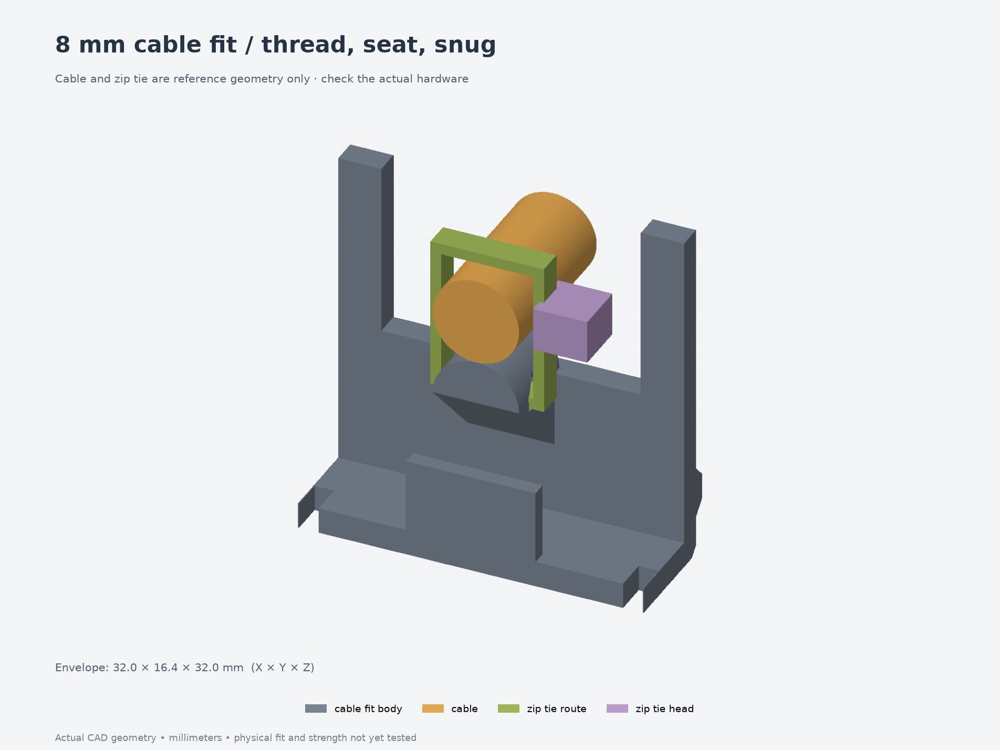

# Measured 8 mm cable fit test — 004

Print **[print-layout.3mf](print-layout.3mf)** to check your measured **8 mm cable**.
The printed geometry matches fit test003; reuse those pieces if already printed.
This updated record and preview use the confirmed cable diameter. It contains two small parts: a section of revision 010's body with the actual
cable anchor and exit, plus its matching lid section. These are cropped directly
from the same source and parameters as the full enclosure at 100% scale.



The body section is **32 × 11.6 × 32 mm**; the lid section is **32 × 10.4 × 4.4 mm**.
Together they contain **3.514 cm³ of CAD solid**; no print-time estimate is assigned.

The cable and zip tie shown are reference geometry and are excluded from the
print. The tie is shown as a loose routing envelope; its tightened shape depends
on the actual cable and tie. Use your real cable and tie for the checks below.

## Print

Print the body floor-down and the lid exterior-down, matching the full enclosure.
Use the intended final material, nozzle, layer height and dimensional compensation;
record them with the result. Unfilled PETG remains the enclosure's provisional
material choice. The 3MF contains geometry only, with no printer profile or G-code.

Start with supports off and inspect the support's sloping underside and passage
roof in your slicer. Keep support scars out of the cable/tie contact areas.
Time and filament consumption have not been estimated with a slicer.

## Fit checks

1. Measure cable outside diameter (or bundle width × thickness), tie width and
   thickness, and tie-head size. The cable is **8 mm outside diameter**, supplied by the user.
   The 2.5 × 1 mm tie and 5 × 5 × 4 mm head remain assumptions; measure those
   and note any cable diameter variation at the retention point.
2. With the lid section removed, feed the tie straight through the passage from
   either side. **Pass:** the tail feeds without forcing, trimming the strap or
   cracking the printed support. The head stays outside the passage.
3. Lay the insulated cable along the rounded support and close the tie with its
   head beside the cable. Keep slack between this point and the electrical
   termination. Snug the tie only enough to retain the cable jacket. **Pass:** it tightens
   without snagging at the passage mouths or visibly notching the strap or jacket.
4. Seat the lid section by hand. **Pass:** it sits flush at the wall rim without
   pressing on the cable or tie head. Check that you can still access the tail
   for trimming; remove the lid for tie installation and replacement.
5. Hold the wall section and gently handle the cable. **Pass:** the cable stays
   seated without visible jacket damage or support cracking. This is an informal
   fit/handling check, not a pull-force qualification.

Report the tested file/revision, measurements and print settings, whether each
check passed, and where anything binds or slips. Record results in
[fit-results.json](fit-results.json). Failed fits should drive updated parameters
in both the full model and the next small test.

## Scope and rebuild

Physical fit is pending. This coupon preserves local wall, support and lid
geometry, but its cut boundaries do not represent the complete enclosure's
stiffness. It does not test PCB fit, button travel, full lid fastening, wiring
bend radius, long-term grip or a rated pull load. There are no lid screw mounts in
this small section; hold the lid in place by hand. The [board-fit test](../002-board-fit-heatsets/)
remains a separate check for the measured PCB.

- [Body section — 3MF](parts/cable_fit_body.3mf) · [lid section — 3MF](parts/cable_fit_lid.3mf)
- [Assembly STEP](assembly.step) · [source](model.py) · [parameters](parameters.json)
- [Geometry checks](validation.json) · [source/crop checks](fit-validation.json)
- [FreeCAD read-back](freecad-validation.json) · [source hashes](source-files.json)

From `Models/ESP32Enclosure`, rebuild into a fresh directory:

```bash
uv run --locked python fit-tests/004-8mm-cable/build-test.py --output builds/8mm-cable-fit
uv run --locked python builds/8mm-cable-fit/render-test.py builds/8mm-cable-fit
uv run --locked python scripts/check-measured-cable-fit.py --full revisions/010-8mm-cable \
  --test builds/8mm-cable-fit --output builds/8mm-cable-fit/fit-validation.json
```

Pass `--params path/to/parameters.json` to try different dimensions. Keep the
coupon wrapper, `enclosure_model.py`, all supporting modules and both build/render
helpers together. The shared source hashes identify the full-enclosure geometry
used for this test.
