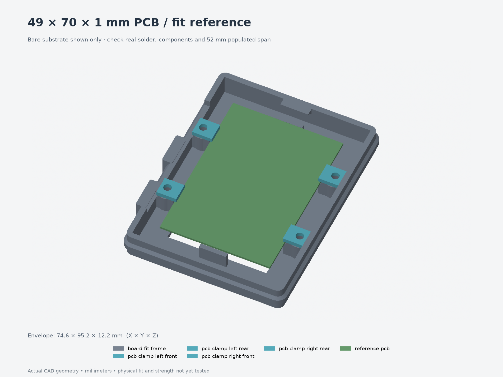

# Test 005 — corrected full-enclosure board width

**[Download the five-part quick-print 3MF](print-layout.3mf)**.
It contains one low open frame and four PCB clamps, taken directly from
[revision 011](../../revisions/011-fit-and-cable-cradle/README.md).
The full enclosure and this frame both move each retention side inward 1.5 mm.



The test retains the full-width shelf/boss/root geometry up to clamp-top height
12.2 mm, with a 44 × 66 mm central floor window to reduce material. Print at
**100% scale**, frame floor-down and clamps flat, using the intended final
material/nozzle/layer height/compensation. Unfilled PETG remains the initial
candidate; final settings are not established. Start with supports off and
inspect the short horizontal cartridge-pilot roofs in the slicer.

Use four **M3×5 heat-set inserts and M3×6 screws**. The modeled OD4.6/pilot4.0 mm
fit is provisional. Install inserts flush before placing the board; M3×8 screws
bottom in these blind pilots and should not be substituted. The four clamps
match revision 010/011, so existing compatible clamps can be reused.

| Check | Nominal / pass criterion |
| --- | --- |
| PCB | 49 × 70 × 1 mm substrate; seats flat on all four ledges without forcing |
| Locating gap, front and rear | 49.8 mm between upright shoulders |
| Inner shelf-face gap, front and rear | 47.4 mm |
| Vertical capture slot | 1.2 mm; 0.2 mm play for the 1 mm board |
| Bare-edge engagement | 0.8 mm nominal, at least 0.4 mm through modeled lateral play |
| Clamp contact | Bare board only; no component, conductor or solder contact |
| Inverted retention | With the board supported during turning, the tightened assembly keeps it captured without slipping off the ledges |
| Populated span | Actual 52 mm ESP32 span clears the clamp hardware |

Tighten clamps against their printed shoulders; do not bend the PCB. Report the
printed locating/shelf gaps at both pairs, how the board sits, and any contact
points. Use [fit-results.json](fit-results.json) to record observations and
printer/material/settings. This revised print has **not been physically tested**.

The open window cannot test central solder protrusions against the full floor;
measure them against the full model's chosen 6.6 mm underside allowance. This
short frame also omits upper components, button linkage, lid, mounting, full
shell stiffness/warping and the full 21.8 mm insert-tool reach. Button positions
remain a separate unresolved layout issue. It does not establish a load rating.

[Individual parts](parts/), [assembly STEP](assembly.step), [print layout](print-layout.png),
[source](model.py), [parameters](parameters.json), [export checks](validation.json),
[FreeCAD checks](freecad-validation.json), and [exact full-STEP comparison](fit-validation.json).
These are model 3MFs without a printer or filament profile; they are not G-code.

Rebuild from `Models/ESP32Enclosure`:

```bash
uv run --locked python fit-tests/005-board-width/build-test.py --output builds/board005
uv run --locked python builds/board005/render-test.py builds/board005
```
