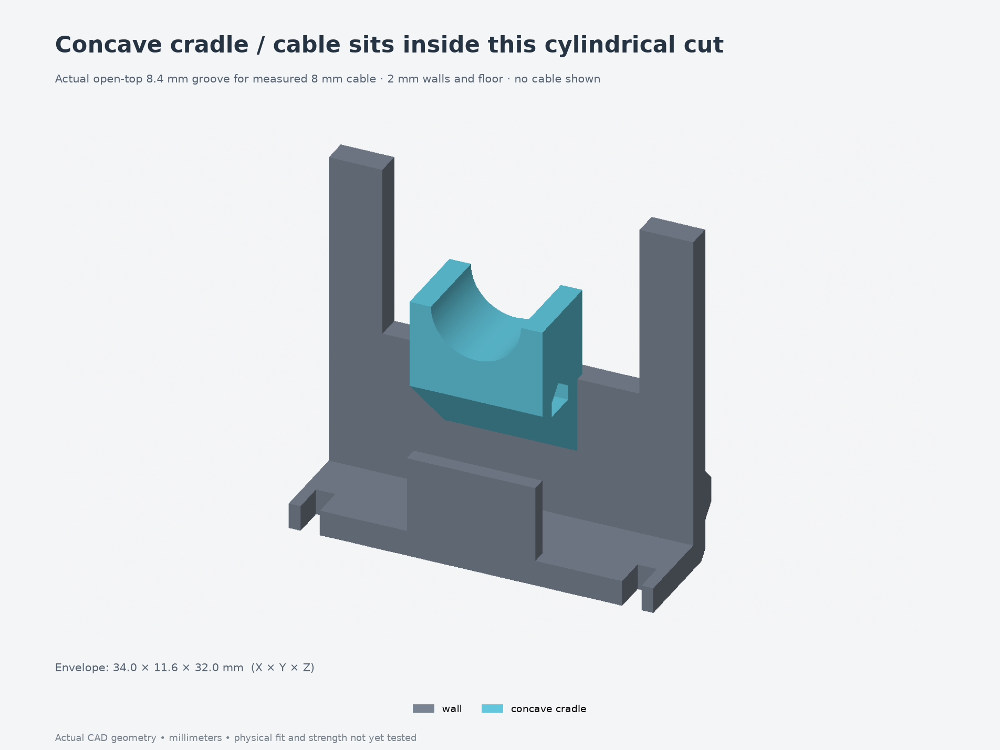
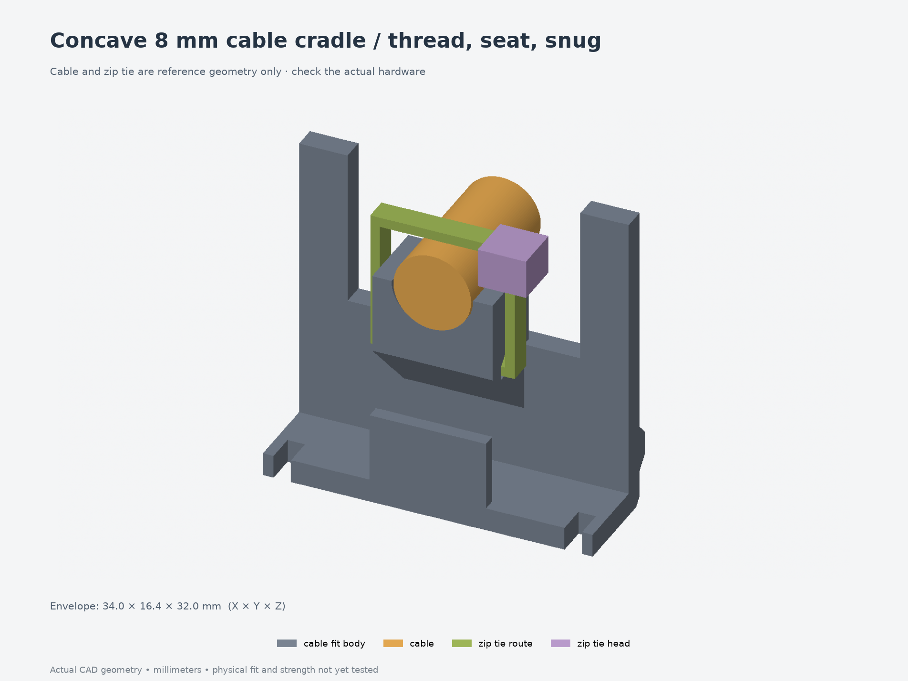

# Concave cable-cradle fit test — 006

Print **[print-layout.3mf](print-layout.3mf)** before the full enclosure to check your measured **8 mm cable** in the new **8.4 mm concave cylindrical groove**. The two small parts are an exact, true-scale crop of revision 011's body/end wall and its matching lid. Older convex-support coupons 003/004 do not test this new seating surface.



The body section is **34 × 11.6 × 32 mm**; the lid section is **34 × 10.4 × 4.4 mm**. Together they contain **4.239 cm³ of CAD solid**. The crop extends 1 mm farther on each side to leave 1.1 mm floor strips beyond the existing tie slots, avoiding a thin crop artifact. Print time and filament usage have not been estimated with a slicer.



The groove is cut out of the block so the cable sits inside it. The nominal allowance is **0.2 mm radially**, with **2 mm sidewalls** and **2 mm of material between the groove bottom and the tie-tunnel roof**. The actual 8 mm cable seats at the groove bottom. The tie head sits above the right shoulder, leaving 2.7 mm below the lid plane in the nominal reference geometry.

Cable, zip tie and tie head shown in the preview are reference shapes only; they are excluded from every print file. The loose tie route is a clearance envelope, not an exact tightened flexible strap.

## Print

Print at **100% scale**, with the body floor-down and the lid exterior-down, matching the full enclosure. Use the final intended material, nozzle, layer height and dimensional compensation, and record those settings. Unfilled PETG remains the provisional material choice. This model 3MF contains geometry, without a printer profile or G-code.

Start with **supports off** for this cradle and inspect the 45-degree underside and tie-passage roof in the slicer. Keep support scars off the groove and tie passage. The geometry was checked digitally at 0.2 mm layers; the actual printer/material result remains untested.

## Fit checks

1. Measure cable outside diameter at the retention point, tie width/thickness and tie-head size. The cable's **8 mm diameter is user supplied**. The **2.5 × 1 mm strap**, **5 × 5 × 4 mm head** and groove allowance remain provisional.
2. With the lid section removed, feed the tie tail through the transverse passage from either side. **Pass:** it threads without force, strap trimming or cracking the cradle. Keep the head outside the passage.
3. Lay the insulated cable into the open cylindrical groove. **Pass:** it reaches the groove bottom by hand, stays within the concave seat and shows no sharp contact or visible jacket damage. Do not force an oversized cable into the groove.
4. Close the tie over the cable with its head above the right shoulder, as shown. Keep internal slack before the electrical termination. Snug only enough to retain the jacket. **Pass:** the strap feeds and tightens without snagging or visibly notching the strap or jacket.
5. Hold the matching lid section on the wall rim by hand. **Pass:** it seats flush without pressing on the cable or tie head. Check access for trimming the tail and later replacing the tie. A standard one-way tie must be **cut to release**; protect the cable jacket when cutting.
6. Hold the wall section and gently handle the cable. **Pass:** the cable remains seated without visible slipping, jacket damage or cracking. This is an informal handling check, not a rated pull-force test.

Record the file/revision, dimensions, printer/material/settings, each pass/fail result and any binding or slipping in [fit-results.json](fit-results.json). Use physical results to update the full model and the next small coupon together. The 0.3 mm radial-clearance variant has been validated digitally; start with the nominal 0.2 mm coupon and adjust only if its physical fit requires it.

## Scope and rebuild

Physical results are pending. This crop retains the actual local wall, cradle and lid geometry, but its cut boundaries do not reproduce full-shell stiffness. It does not establish PCB fit, button travel, the complete lid fastening, cable bend radius, long-term grip or a rated pull load. The coupon omits lid screws; hold its lid in place by hand. The revised [board-fit test 005](../005-board-width/) is a separate fit check.

- [Body 3MF](parts/cable_fit_body.3mf) · [Lid 3MF](parts/cable_fit_lid.3mf) · [Assembly STEP](assembly.step)
- [Source](model.py) · [Parameters](parameters.json) · [Source hashes](source-files.json)
- [CAD/mesh validation](validation.json) · [Exact full-part crop comparison](fit-validation.json) · [FreeCAD read-back](freecad-validation.json)
- [Full revision 011](../../revisions/011-fit-and-cable-cradle/)

From `Models/ESP32Enclosure`, rebuild into a fresh directory:

```bash
uv run --locked python fit-tests/006-cable-cradle/build-test.py --output builds/cable-cradle-fit
uv run --locked python builds/cable-cradle-fit/render-test.py builds/cable-cradle-fit
uv run --locked python scripts/check-measured-cable-fit.py --full revisions/011-fit-and-cable-cradle \
  --test builds/cable-cradle-fit --output builds/cable-cradle-fit/fit-validation.json
```

Use `--params path/to/parameters.json` for an intentionally revised test. Keep `model.py`, `enclosure_model.py`, the supporting modules and build/render helpers together. The exact-crop checker requires the corresponding full-model build to use the same parameters and source.
