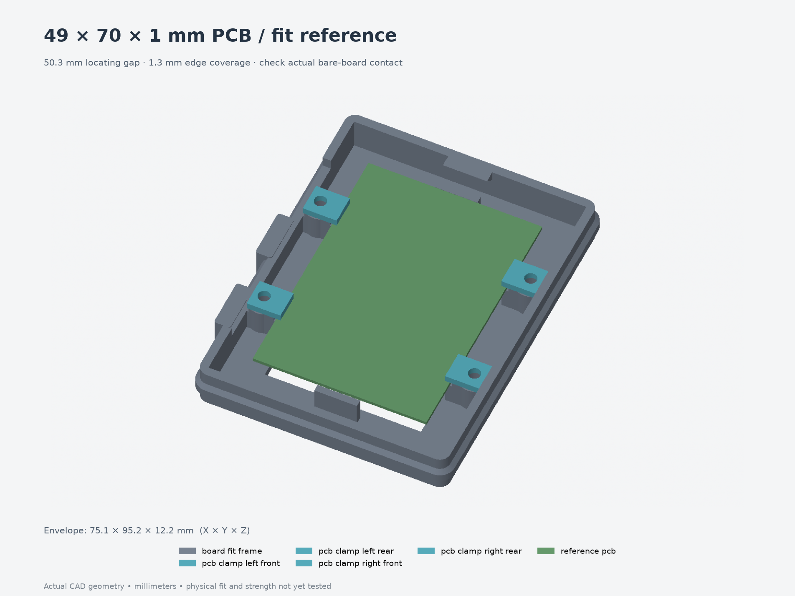

# Test 007 — more clearance and deeper board capture

**[Download the five-part quick-print 3MF](print-layout.3mf)**: one low open frame
and four clamps, all using [revision 012](../../revisions/012-easier-board-fit/README.md)
interfaces at true scale. This replaces test 005 for the newly requested fit.



The frame widens 0.5 mm overall. The shelves and matching upper clamps extend
0.5 mm farther under/over each centered board edge. The PCB reference remains
49 × 70 × 1 mm; reference electronics are not included in the print files.

| Check | Nominal / pass criterion |
| --- | --- |
| Locating gap, both clamp pairs | **50.3 mm**, previously 49.8 mm |
| Inner shelf-face gap, both pairs | **46.4 mm**, previously 47.4 mm |
| Board slot height | **1.2 mm** for the 1 mm PCB; unchanged |
| Side movement | **0.65 mm** per direction from centered position |
| Board-edge coverage | **1.3 mm** centered, at least **0.65 mm** at lateral stops |
| Board seating | Sits flat on all four ledges without forcing or bending |
| Contact strips | Bare PCB above and below; no solder, conductor or component contact |
| Inverted retention | Board stays captured after fitting clamps; support it while turning the frame |
| Populated assembly | Actual 52 mm ESP32 span clears clamps and hardware |

Print at **100% scale**, frame floor-down and clamps flat, with intended final
material, nozzle, layer height and dimensional compensation. Unfilled PETG
remains the initial candidate; no printer profile is embedded. Start with
supports off and inspect the short cartridge-pilot roofs in the slicer.

Use the **new four clamps** supplied here, four **M3×5 heat-set inserts** and
four **M3×6 screws**. The old shorter clamps do not reproduce this deeper fit.
Install inserts flush before placing the board and tighten clamps against their
printed shoulders. Insert OD4.6/pilot4.0 mm are provisional. M3×8 screws bottom in
the blind pilots and should not be substituted.

The test retains the full-width shelf/boss/root geometry to Z12.2 mm, with a
44 × 66 mm central floor window to save material. It cannot check central
underside solder clearance, full-shell stiffness/warping, upper parts, lid,
desk mounting, full-height tool access or button alignment. Measure underside
protrusions against the full model's chosen 6.6 mm allowance separately. This
coupon does not establish load capacity or confirm the measured switch layout.

**Physical results are pending.** Record measured gaps at both pairs, where any
binding occurs, bare-edge contact and inverted retention in
[fit-results.json](fit-results.json), together with printer/material/settings.
The test source and full model should be updated together after the next result.

[Individual STEP/3MF parts](parts/), [assembly STEP](assembly.step), [source](model.py),
[parameters](parameters.json), [export validation](validation.json),
[FreeCAD validation](freecad-validation.json) and [exact full-STEP comparison](fit-validation.json).

Rebuild from `Models/ESP32Enclosure` into a fresh directory:

```bash
uv run --locked python fit-tests/007-board-easier-fit/build-test.py --output builds/board007
uv run --locked python builds/board007/render-test.py builds/board007
```
