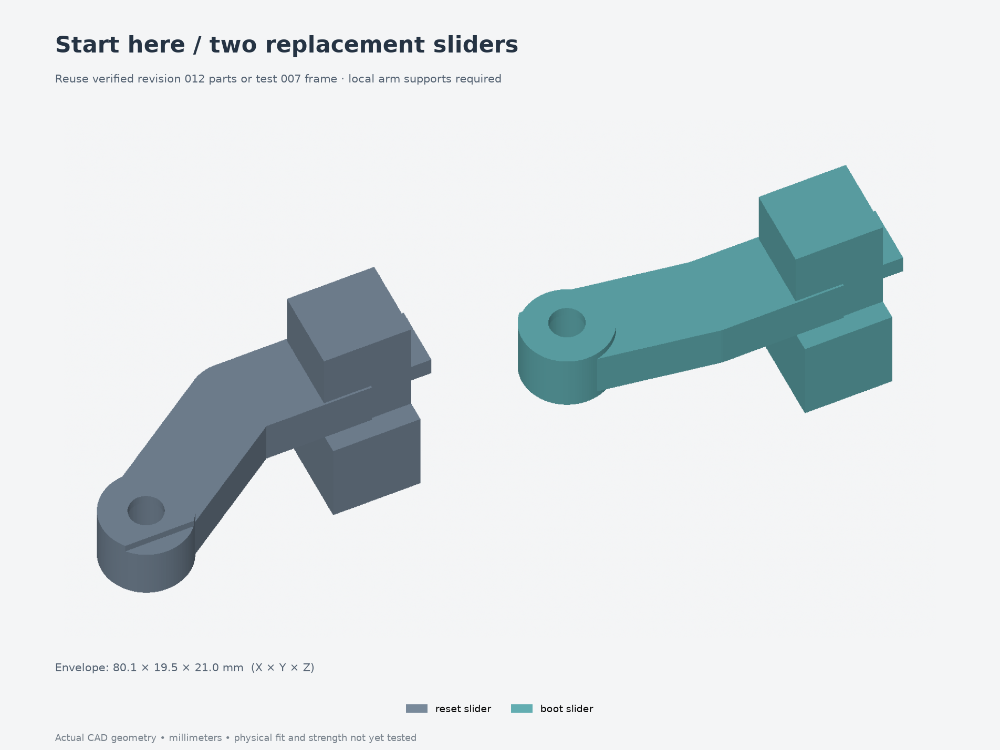
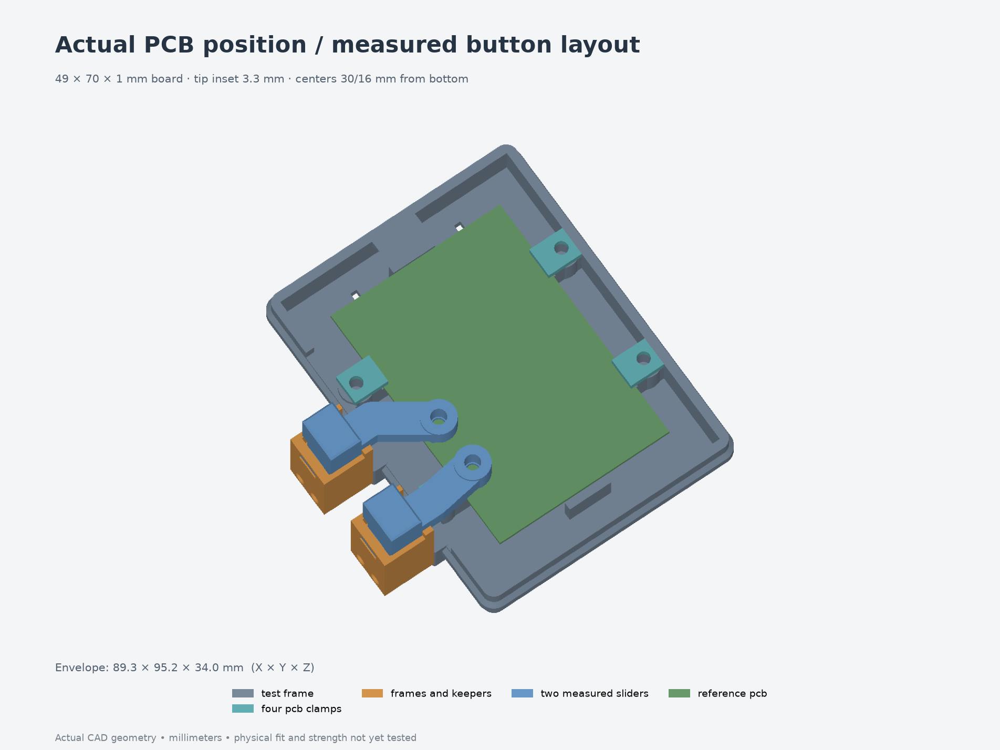

# Test 008 — measured button alignment

**Start with [the two-slider 3MF](sliders-only.3mf)** if you already have a
revision 012 enclosure or test 007 frame with its button cartridges. These are
the two actual revision 013 sliders. The existing frame/body, clamps, stationary
cartridge pieces and moving-magnet keepers are reusable; the
[comparison report](fit-validation.json) checks their geometry.



For a fresh setup, use the **[13-piece test layout](print-layout.3mf)**: one low
frame, four PCB clamps and both four-piece cartridges. The frame is the same
production crop and 44×66 mm floor window as [test 007](../007-board-easier-fit/).
The print files contain no reference board, magnets or screws.



The nominal tips now sit **3.3 mm from the perfboard's left edge**, with RESET
**30 mm from the bottom** and BOOT **16 mm from the bottom**. That gives 14 mm
between centers. The 49×70×1 mm board sits at local Z9..10. Switch height and
actual travel are still unmeasured; adjust the nylon contacts using the real
assembly before pressing against a switch.

## Print and reuse

Keep 100% scale and use the intended enclosure filament, nozzle, layer height
and compensation. The sliders retain their production orientation, with the
extended finger-pad faces on the bed. Use local removable support beneath the
elevated arms/guides; keep support scars off guide and magnet-fit surfaces.
No printer/filament profile is embedded in these geometry-only 3MF files.

For the two-slider trial, fit **two M3×5 heat-set contact inserts** to the new
sliders before installing magnets. Reuse the existing magnets, small moving
keepers, M3×12 nylon adjusters and nylon jam nuts. Preserve magnet orientation:
like poles face each other across each cartridge gap. Install the sliders using
the [production assembly guide](../../assembly-guides/013-buttons/README.md).

For the fresh 13-piece jig, the hardware is:

| Joint | Hardware |
| --- | --- |
| Four PCB clamps | Four M3×5 inserts and four M3×6 socket screws |
| Two cartridges to frame | Four short M3×4 inserts and four M3×18 socket screws |
| Two moving contact tips | Two M3×5 inserts, two M3×12 nylon screws and two nylon jam nuts |
| Magnetic return | Four Ø4×2 mm magnets |

Insert OD 4.6 mm and the 4.0 mm pilots are provisional. Confirm the purchased
inserts and printed fit. The short cartridge inserts are 4 mm long; do not
substitute the 5 mm contact/PCB inserts there. Fit the PCB and its clamps before
attaching the cartridges. M3×8 PCB screws bottom in the clamp pilots; use M3×6.

## Physical checks

1. Back the nylon contacts away from the switches. Seat the unpowered board on
   all four ledges and tighten the clamps onto their shoulders without bending
   it. Confirm the 1.3 mm contact strips touch bare PCB on both faces.
2. Center the board using equal side/end gaps. Compare each nylon tip with the
   actual switch center. The locating gap is 50.3 mm, allowing ±0.65 mm movement
   in X and ±0.4 mm in Y; also check contact at those limits.
3. Check smooth slider movement, magnetic return and printed hard stops with
   the tips still backed off. Set each tip gradually against the real switch,
   ensuring release at rest and avoiding excess switch depression. The CAD's
   0.8 mm stroke/0.6 mm idle gap/0.2 mm depression are provisional settings.
4. Support the PCB while turning the jig over, then test the production
   press-up direction. The board rests against its clamps in this orientation;
   its 0.2 mm vertical play changes the effective tip gap.
5. Fit the actual USB plug before attaching the cartridges, route its cable,
   and operate each button separately and together. Check the plug, clamp screw
   head and wiring throughout the stroke. A straight plug-in approach with
   both cartridges mounted has not been established.
6. Check the adjusted nylon heads against the real lid in the two-slider trial.
   In this open jig, the omitted inner lid plane is local Z32, or 23 mm above the
   ledges. The default head height is only a model assumption; preserve actual
   clearance after adjusting the contacts.

The provisional 8×6 mm rectangular USB-plug probe intersects the left-front PCB
clamp screw head; its straight outer approach also hits the BOOT frame. Plugging
in first addresses the outer approach, **not the clamp-head conflict**. The
digital report records both obstructions and the sampled outer cable path;
actual plug/cable dimensions remain unmeasured.

**Physical results are pending.** Record alignment, PCB position, switch
release/return, plug clearance and any binding in [fit-results.json](fit-results.json).
The low frame omits upper walls, lid, desk bracket and the central floor, so it
cannot establish full-shell stiffness, central underside solder clearance,
complete connector fit or load capacity.

## Files and rebuild

- [Individual STEP/3MF parts](parts/) and [assembly STEP](assembly.step).
- [Two-slider 3MF](sliders-only.3mf), [full 13-piece 3MF](print-layout.3mf), and
  [hardware reference STEP](hardware-reference.step).
- [Source](model.py), [parameters](parameters.json),
  [production source hashes](production-source.json),
  [export checks](validation.json), and [fit/reuse/motion checks](fit-validation.json).

From `Models/ESP32Enclosure`, use a fresh output directory:

```bash
uv run --locked python fit-tests/008-button-alignment/build-test.py --output builds/buttons008
uv run --locked python builds/buttons008/render-test.py builds/buttons008
uv run --locked python builds/buttons008/check-fit.py --source builds/buttons008 \
  --production revisions/013-measured-buttons \
  --reuse-frame fit-tests/007-board-easier-fit \
  --reuse-enclosure revisions/012-easier-board-fit \
  --output builds/buttons008/fit-validation.json
```

The builder snapshots the exact full-enclosure source files beside the test
wrapper. The checker compares the frame with the actual production STEP crop,
checks reuse against test 007/revision 012, reopens the two-slider 3MF and tests
sampled motion and hardware contacts. Geometry checks do not replace the
physical alignment and return tests above.
