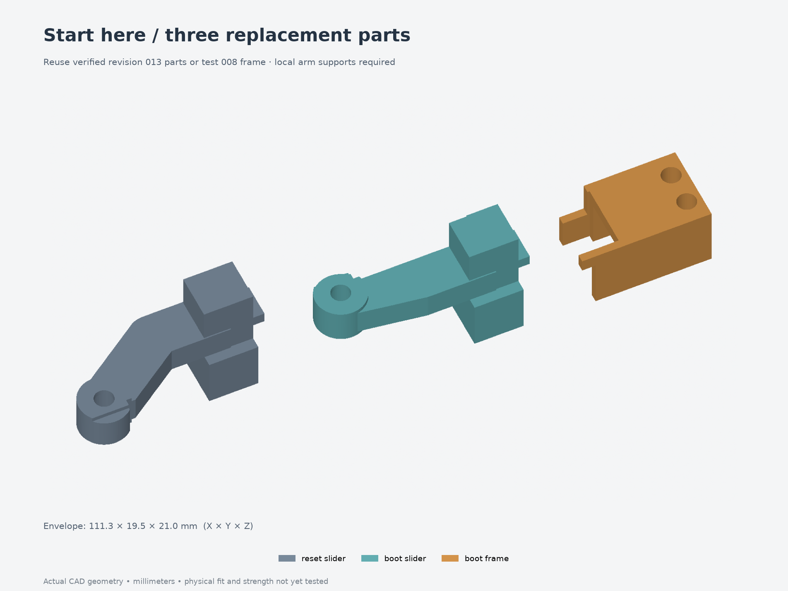
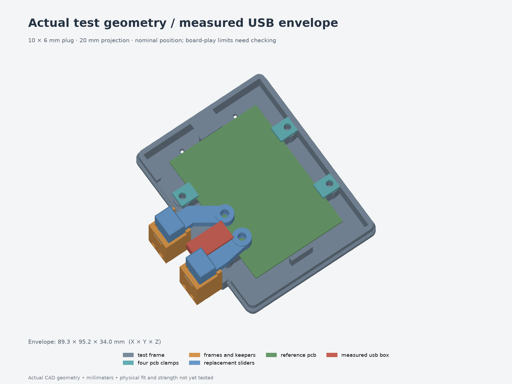

# Test 009 — measured USB clearance

**Start with [the three replacement parts](replacements-only.3mf)** if you have a
revision 013 assembly or test 008 jig: RESET slider, BOOT slider and BOOT frame.
They are the exact revision 014 production parts. The other 12 full-enclosure
parts, including the body and four PCB clamps, remain reusable; the
[comparison report](fit-validation.json) verifies their geometry.



For a fresh setup, use the **[13-piece test layout](print-layout.3mf)**: one low
frame, four PCB clamps and both four-piece cartridges. Its frame and clamps are
reusable from [test 007](../007-board-easier-fit/) or
[test 008](../008-button-alignment/). The central floor window saves material
while retaining the production ledges, locating shoulders and mounting pilots.



The USB plug measures **10 mm wide, 6 mm thick and 20 mm from the perfboard's
left edge to the flexible cable**. Its center is 23 mm from the board's bottom;
its underside is 9 mm above the PCB surface and its top is 15 mm above it. The
cable is Ø3.5 mm. The red reference is a conservative rectangular plug box,
not a reconstruction of an unmeasured taper. These dimensions do not change the
separate 8 mm power-cable cradle. The digital cable probe assumes an exit at
plug mid-height; the actual cable-axis height, bend and transition shape remain
unmeasured.

The 49×70×1 mm PCB sits at local Z9..10. RESET remains 30 mm from the bottom,
BOOT 16 mm; both tips are 3.3 mm from the left edge. Switch height and travel
remain provisional.

## Print and install

Use 100% scale and the intended final material, nozzle, layer height and
compensation. These geometry-only 3MFs contain no printer or filament profile.
Keep the supplied print orientations. The slider finger-pad faces sit on the
bed; use local removable support beneath the elevated arms/guides and protect
sliding and magnet-fit surfaces from support scars.

For the three-part trial, install two new M3×5 contact inserts in the replacement
sliders. Reuse the existing nylon adjusters/jam nuts, magnets, rear keepers and
small moving-magnet keepers. The replacement BOOT frame receives the existing
fixed magnet. Preserve like poles facing each other across both magnetic gaps.
Remove the cartridges before servicing the PCB clamps; fit the PCB and plug
before refitting the cartridges. Follow the
[production assembly guide](../../assembly-guides/014-buttons/README.md) for the
plug-first assembly order: hold each frame in position, lower its slider from
above, then install the rear keeper. Do not force a fully assembled cartridge
inward past the plug.

For a fresh 13-piece jig:

| Joint | Hardware |
| --- | --- |
| Four PCB clamps | Four M3×5 inserts and four M3×6 socket screws |
| Two cartridges to frame | Four short M3×4 inserts and four M3×18 socket screws |
| Two moving contact tips | Two M3×5 inserts, two M3×12 nylon screws and two nylon jam nuts |
| Magnetic return | Four Ø4×2 mm magnets |

Insert OD 4.6 mm and 4.0 mm pilots remain purchased-hardware/print-fit assumptions.
Do not substitute 5 mm inserts for the short cartridge inserts or M3×8 screws for
the M3×6 PCB screws. Heat-set before installing the PCB or magnets.

## Fit checks

1. Back both nylon contacts away from the switches. Seat the unpowered board on
   the four ledges and tighten the clamps onto their shoulders without bending
   the PCB. Start centered within the locating gaps.
2. Fit the **actual USB plug and cable**. Check the entire molded plug, the
   flexible transition, clamp heads and cartridge cutouts. Do not force a plug
   through an interference or assume the rectangular reference matches its taper.
3. Check each slider separately and both together through the full stroke,
   first with contacts backed off. Verify smooth magnetic return and both
   printed stops. Then adjust the contacts so each real switch releases at rest
   and cannot be excessively depressed.
4. Repeat the plug and tip-alignment checks at the PCB's locating limits:
   ±0.65 mm in X, ±0.4 mm in Y and 0.2 mm vertical play. Record any direction
   that binds. A centered-board pass does not establish clearance at every limit.
5. Support the PCB while turning the jig over and check the production press-up
   direction. Check the cable's actual bend/exit and make sure it does not move
   the board or apply force to the USB socket.
6. On the full enclosure, close the actual lid after adjusting the contacts.
   The open jig omits the local Z32 inner lid plane; it cannot prove lid clearance.

The centered-board USB box and assumed cable path clear all five sampled button
states. At the sampled XY movement limits, the plug box or cable probe hits
geometry: **120 of 135 board/motion combinations are obstructed**. Only the
centered XY position clears at all three sampled board heights. The straight
external plug-in approach also remains blocked by the assembled BOOT cartridge.

**Physical fit remains untested.** These movement-limit conflicts remain
unresolved until the real plug taper, cable exit and board seating are tried.
Use the plug-first assembly sequence and record the actual limits; do not treat
the nominal centered-board result as clearance throughout the locating gap.

Record results in [fit-results.json](fit-results.json). The low frame omits the
upper shell, lid, desk bracket and central floor, so it does not establish full
connector access, underside solder clearance, case stiffness or load capacity.

## Files and repeatable build

- [Three-part replacement 3MF](replacements-only.3mf) and [fresh 13-piece 3MF](print-layout.3mf).
- [Individual STEP/3MF parts](parts/), [assembly STEP](assembly.step), and
  [hardware reference STEP](hardware-reference.step).
- [Source](model.py), [parameters](parameters.json), [production source hashes](production-source.json),
  [export checks](validation.json), [fit/reuse/motion report](fit-validation.json),
  and [FreeCAD checks](freecad-validation.json).

From `Models/ESP32Enclosure`, choose a fresh output directory:

```bash
uv run --locked python fit-tests/009-usb-clearance/build-test.py --output builds/usb009
uv run --locked python builds/usb009/render-test.py builds/usb009
uv run --locked python builds/usb009/check-fit.py --source builds/usb009 \
  --production revisions/014-usb-clearance \
  --reuse-frame fit-tests/008-button-alignment \
  --reuse-enclosure revisions/013-measured-buttons \
  --output builds/usb009/fit-validation.json
```

The builder snapshots all required production source beside the test wrapper.
The checker compares actual exported production STEP, verifies the ten reusable
jig parts/twelve full-enclosure parts, reopens the three-part 3MF and checks PCB
seating, sampled actuator motion, hardware and USB envelopes.
