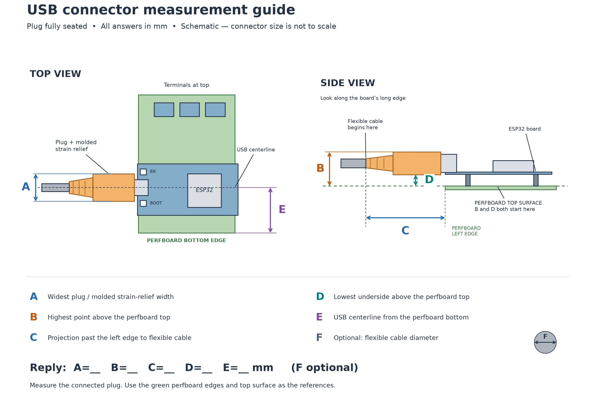

# USB connector measurements

Measure with the USB plug fully seated. All values are millimeters. Use the
green perfboard's edges and top surface as the datums.



| Letter | Measurement |
| --- | --- |
| A | Maximum molded plug/strain-relief width |
| B | Highest point above the perfboard top |
| C | Projection past the perfboard left edge to where the cable becomes flexible |
| D | Lowest plug underside above the perfboard top |
| E | USB centerline distance from the perfboard bottom edge |
| F | Optional flexible cable diameter |

Reply as `A=__ B=__ C=__ D=__ E=__ F=__ mm`. B and D share the same height
datum, so the plug thickness is B minus D.

The [2026-09-13 response](../2026-09-13-usb-connector.json) initially used B for
thickness. The user explicitly clarified **6 mm thickness, 9 mm underside
height, 15 mm top height**. The raw answer and its corrected interpretation
are both retained in the record.

This schematic specifies measurement endpoints. Its connector proportions
are illustrative and are not CAD inputs. [SVG version](usb-measurements.svg).
The [drawing script](draw.py) regenerates both image formats from scratch:

```bash
uv run --locked python measurements/usb-connector-guide/draw.py
```

The diagram does not establish strain-relief taper, cable bend radius, inboard
jack shape or the shape of the connected plug between its maximum dimensions.
