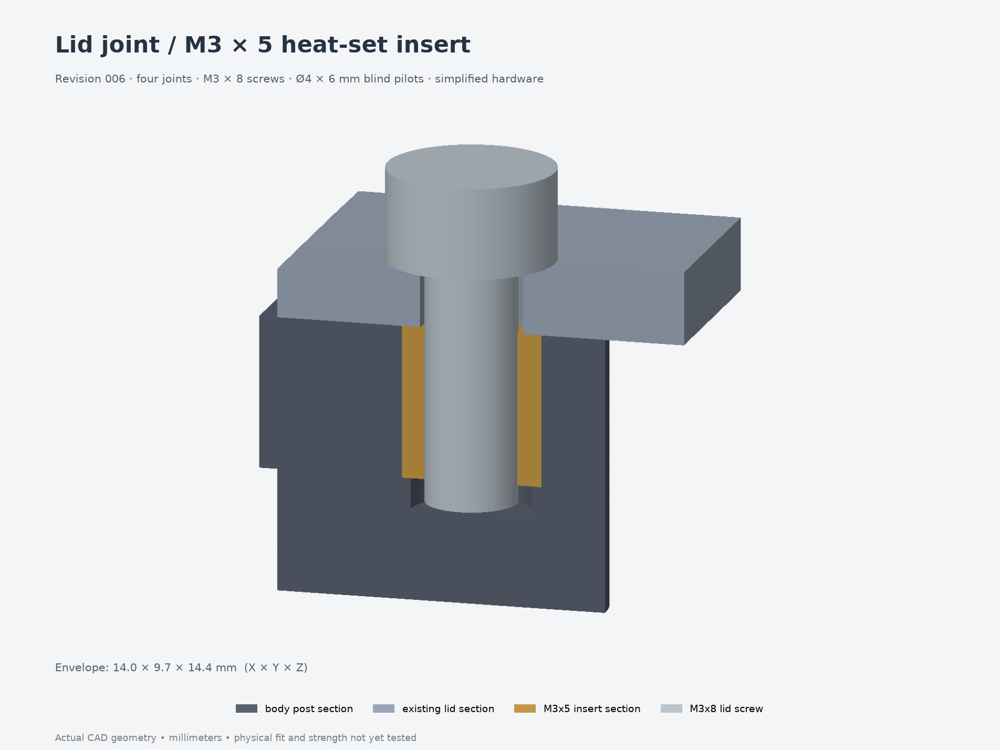

# Revision 006 — lid heat-set inserts

The **four lid-to-body joints** now use **M3×5 heat-set inserts and M3×8 screws**.
The old lid hex-nut pockets and side-entry slots are removed from the body.
**Reprint only the body:** revision 005's lid and all other printed parts are unchanged.
Revision 005 and the earlier files remain preserved.

- [Replacement body 3MF](parts/body.3mf) · [body STEP](parts/body.step)
- [Complete assembly STEP](assembly.step) · [15-part print layout](print-layout.3mf)
- [Assembly instructions and hardware](design-notes.md)
- [Editable source](model.py) · [parameters](parameters.json)
- [CAD/mesh checks](validation.json) · [lid-joint checks](lid-validation.json) · [FreeCAD checks](freecad-validation.json)

Install each insert flush from the open body rim before fitting the lid. The pilots
are **Ø4.0 × 6.0 mm deep**, based on provisional **4.6 mm OD × 5 mm long** inserts.
Confirm your insert's outside diameter and printed fit. Use **M3×8 socket screws
without washers** for the 2.4 mm lid; the old M3×10 lid screws bottom in these bores.
The simplified brass and screw geometry in the image is reference hardware,
excluded from the printable files.

This is a lid-fastener compatibility update to revision 005. It retains that
revision's PCB clamps and button layout, including its four PCB-clamp nuts.
The measured **49 × 70 × 1 mm PCB** and heat-set edge clamps are in the separate
[002 board-fit test](../../fit-tests/002-board-fit-heatsets/); the measured board
and 14 mm button spacing still require integration into the full enclosure.
