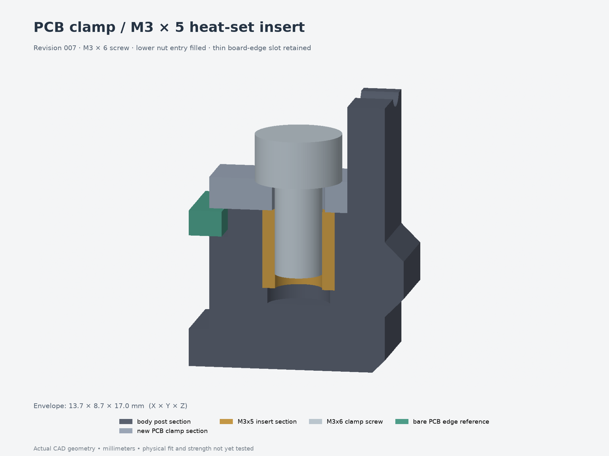

# Revision 007 — PCB clamps with heat-set inserts

The four PCB-clamp nut pockets shown in the screenshot are now replaced by
**M3×5 heat-set inserts and M3×6 screws**. The lower nut-entry windows are filled.
The thin upper slots remain because they capture the PCB edge.

**Reprint the body and all four clamps together.** The screw axes moved 0.4 mm
outward to make room for reinforced insert bosses. The other ten printed parts,
including the lid, bracket and button cartridges, match revision 006.

- [Five replacement parts — 3MF](replacement-parts.3mf) · [print preview](replacement-parts.png)
- [Individual STEP/3MF files](parts/) · [full assembly STEP for Fusion](assembly.step)
- [Hardware and assembly instructions](design-notes.md)
- [Editable source](model.py) · [parameters](parameters.json)
- [CAD/mesh checks](validation.json) · [PCB-mount checks](pcb-validation.json) · [FreeCAD checks](freecad-validation.json)

The lid still uses **M3×8 screws** with its four M3×5 inserts. PCB-clamp screws
are **M3×6**; the previous M3×8 clamp screws bottom in the new blind pilots.
Insert OD4.6 mm and pilot Ø4.0 mm remain provisional; confirm the actual insert
and printed fit. Older revisions and fit tests are preserved.

No captive hex-nut pockets remain in the exported printed parts. The two nylon
jam nuts on the adjustable button contacts remain separate hardware.

This fastener revision retains the earlier full-model PCB/button layout. The
measured **49 × 70 × 1 mm PCB** and heat-set edge clamps are in the separate
[002 board-fit test](../../fit-tests/002-board-fit-heatsets/); that board and its
14 mm button spacing still need integration into the full enclosure.
