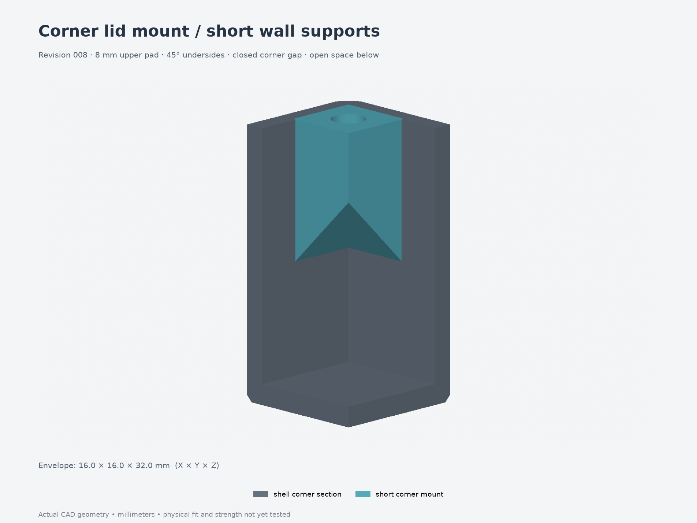

# Revision 008 — compact corner lid mounts

The four tall cylindrical lid posts are replaced by **short corner pads with
45° supports from both walls**. The gaps behind the old posts are filled at the
mounts, and the space below the supports is open. Lid hardware stays the same:
**four M3×5 heat-set inserts and four M3×8 screws**.

**Reprint the body and matching lid.** Closing the corner gaps required trimming
four sections of the lid's locating lip; its exterior and screw positions are
unchanged. The other thirteen printed parts from revision 007 can be reused.

- [Two replacement parts — 3MF](replacement-parts.3mf) · [print preview](replacement-parts.png)
- [Body STEP](parts/body.step) · [lid STEP](parts/lid.step) · [full assembly STEP](assembly.step)
- [Corner detail](corner-boss.png) · [dimensions and assembly notes](design-notes.md)
- [Editable source](model.py) · [parameters](parameters.json)
- [CAD/mesh checks](validation.json) · [corner checks](corner-validation.json) · [FreeCAD checks](freecad-validation.json)

Blue highlights the mount within the printed body.

The 8 mm-thick upper pads retain **2 mm of material below the 6 mm-deep insert
bores**. The supports extend inward from the walls as the body prints upward. They are designed
without added supports; actual print quality remains dependent on the printer
and settings. The volume comparison is in the design notes; no slicer time
estimate or physical load rating is claimed.

PCB clamps retain revision 007's M3×5 inserts and **M3×6** screws. The earlier
board/button layout is still present; the measured 49 × 70 × 1 mm board and
14 mm button spacing remain separate from this corner-mount change. Use the
[corrected board-fit test](../../fit-tests/002-board-fit-heatsets/) for that board.
Older revisions and fit tests are preserved.
