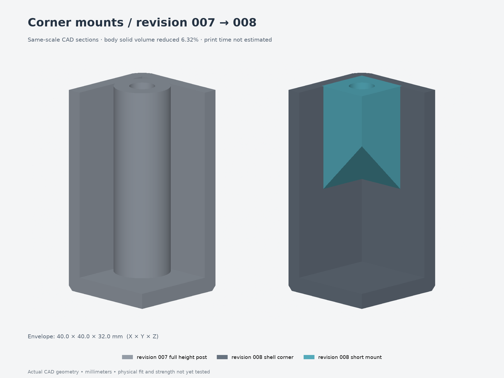

# Compact corner lid mounts — revision 008

The old full-height round lid posts left small gaps against the inner corners.
This revision replaces them with solid upper corner pads and two sloping supports
at each corner. Each support grows inward from an adjacent wall, so the mount no
longer needs a column extending down to the floor. The pads close the old gaps.

Reprint **the body and lid** using `replacement-parts.3mf`. The four corner
sections of the lid's locating lip are trimmed to clear the filled pads with
0.3 mm clearance. The lid exterior, ventilation and screw centers are unchanged.
All thirteen other printed parts and all hardware retain revision 007's geometry
and placement. Keep the revision 007 PCB clamps with their matching screw layout;
older clamp holes differ. Every previous revision and fit test is preserved.

## Corner geometry

| Feature | Nominal dimension in the body print frame |
| --- | --- |
| Upper pad | 8.4 mm projection inward from both cavity walls, plus 0.4 mm wall overlap |
| Pad height | 8 mm, from Z24 to the rim at Z32 |
| Sloping supports | 45° from the horizontal; roots at Z15.6 on both adjacent walls |
| Lid screw centers | X±30, Y±40 mm, unchanged |
| Insert | M3 thread, 5 mm long, provisional OD4.6 mm |
| Insert pilot | Ø4.0 × 6.0 mm deep, bottom at Z26 |
| Solid material below pilot | At least 2 mm to the underside of the upper pad |
| Material outside insert | At least 2.1 mm; the pad also joins both walls |
| Lid screw | M3×8 socket head, no washer, through the existing 2.4 mm lid |
| Screw engagement / bottom clearance | Full 5 mm insert length / 0.4 mm nominal tip margin |

The paired slopes are joined, not isolated gussets. At each increasing print
height, material extends from the nearer wall. This construction avoids an
unsupported diagonal corner or a boss starting in midair. Upper pads retain the
full insert depth, blind-bore floor and wall connections needed for the lid joint.
These are geometric dimensions, not an insert pullout or mounting load rating.

The shape is parameterized in the model and parameter file. Changing pad height
or support angle must preserve the insert floor, wall connection, clearance and
printable slope; use the independent corner checker after a change.

## Solid volume comparison

| CAD solid volume | Revision 007 | Revision 008 | Reduction |
| --- | --- | --- | --- |
| Body | 49.534 cm³ | 46.405 cm³ | 3.129 cm³ (6.32%) |
| All fifteen printed parts | 97.978 cm³ | 94.827 cm³ | 3.151 cm³ (3.22%) |

These are geometric volumes, before slicer infill and perimeter choices. They
do not establish filament consumption or print time. The simplification removes
the long columns and tiny corner pockets; an actual time comparison needs the
same printer, filament and slicer settings for both revisions.



## Printing and assembly

Print the body floor-down and the lid exterior-down, as in revision 007.
Unfilled PETG remains the initial material candidate. No sacrificial supports are
modeled for the new mounts. Review the slopes and unchanged shell/horizontal-hole
bridges in your slicer using the intended layer height and filament.

Install the four lid inserts flush from the open rim, then seat the new lid and
fit four **M3×8** screws. The former M3×10 lid screws are too long for the blind
bores. Insert OD4.6 mm and pilot Ø4.0 mm are provisional until checked against the
purchased insert and a printed fit sample. A short boss does not require a shorter
lid screw: the lid, rim, insert and screw-tip positions are retained.

The other fasteners are unchanged:

| Joint | Hardware |
| --- | --- |
| Lid to body | 4 M3×5 inserts + 4 M3×8 screws |
| PCB clamps | 4 M3×5 inserts + 4 M3×6 screws |
| Desk bracket | 4 M3×5 inserts + 4 M3×10 screws |
| Button contacts | 2 M3×5 inserts + 2 nylon M3×12 adjusters and separate nylon jam nuts |
| Cartridge mounting | 4 M3×4 inserts + 4 M3×18 screws |
| Bracket to desk | Screws selected for the actual desk material and thickness |

There are fourteen M3×5 inserts and four M3×4 inserts. No captive hex-nut pockets
are introduced. The existing PCB insert installation still requires a narrow tool:
Ø6 mm shaft with 21.8 mm reach before a wider barrel can clear the rim. Install
those inserts before the PCB/cartridges, and remove the BOOT cartridge for later
left-front clamp screw access. See [revision 007](../007-pcb-heatsets/design-notes.md)
for its unchanged clamp and button assembly details.

## Fit scope

The model still retains the earlier 52 × 70 × 1.6 mm PCB assumption and original
button positions. The measured 49 × 70 × 1 mm substrate and 14 mm button spacing
have not been integrated into this full enclosure. The [corrected fit test](../../fit-tests/002-board-fit-heatsets/)
remains the appropriate retention check for the measured board. Actual component,
connector, magnetic-return and wiring clearances remain unverified physically.

## Digital checks and rebuild

`validation.json` checks all fifteen CAD solids, individual STEP/3MF read-back,
units, print placement and assembly interference. `replacement-validation.json`
checks the two-object replacement 3MF. `freecad-validation.json` records independent
STEP reopening in FreeCAD. `inspection.FCStd` contains imported geometry; the
parametric master remains Python. Fusion's export helper now defaults to revision
008; native F3D conversion still requires a run inside Fusion.

`corner-validation.json` compares against revision 007. It covers the four corner
changes, the local lid-lip trims, unchanged parts and hardware, insert/screw
clearance, wall connections, cavity clearance and sloping-support printability.
The nominal 8 mm pad / 45° support and an 8.5 mm pad / 50° variant both pass.
The checker inspects 336 nominal and 380 variant corner sections at 0.2 mm layer
spacing, using Euclidean support offsets to catch diagonal overhang errors.
Wall roots remain connected, and no corner pinholes or enclosed pockets remain.
A 7.5 mm pad is rejected for insufficient material below the insert bore.
The old untrimmed lid interferes with the new body by 16.213 mm³; the new lid
seats without collision. This is why the body needs its matching lid.
The separate hardware STEP contains 34 unchanged simplified hardware proxies;
threads and some other fasteners are omitted from that reference file.

From `Models/ESP32Enclosure`, regenerate into a fresh output directory:

```bash
uv run --locked python revisions/008-corner-bosses/build-revision.py --output builds/corner-check
uv run --locked python builds/corner-check/render-details.py builds/corner-check
uv run --locked python scripts/check-corner-bosses.py --source builds/corner-check \
  --baseline revisions/007-pcb-heatsets --output builds/corner-check/corner-validation.json
```

Keep all five CAD inputs and both build/render helpers together. `source-files.json`
records their hashes, and the corner report records the independently checked CAD
inputs and checker hash. Runtime setup and optional FreeCAD commands are in the
[package README](../../README.md#rebuild).
