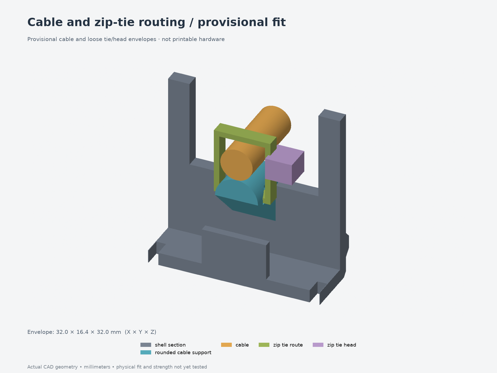

# Revision 009 — rounded cable support and zip-tie retention

A solid rounded support now sits just inside the end cable opening. One zip tie
threads through the passage below it and closes around the support and cable.
The support follows the cable's direction and joins the end wall through a 45°
underside. Its passage has a 45° roof for printing without added supports.

**Print the [small cable-fit test](../../fit-tests/003-cable-retention/print-layout.3mf)
first.** Its actual body and lid sections check threading, cable seating, tie-head
position and lid closure. [Test instructions](../../fit-tests/003-cable-retention/README.md)
include what to measure and report; physical results are pending.

Only the **body** changes from revision 008. Its lid and all thirteen other parts
remain compatible, with the same screws, inserts, PCB clamps and button mechanism.
Add one zip tie; its dimensions and the cable diameter remain provisional.

- [Replacement body — 3MF](parts/body.3mf) · [body STEP](parts/body.step)
- [Full assembly STEP](assembly.step) · [all printable parts](parts/)
- [Cable support detail](cable-anchor.png) · [lid clearance](cable-closure.png)
- [Source](model.py) · [parameters](parameters.json) · [design notes](design-notes.md)
- [CAD and mesh checks](validation.json) · [independent cable checks](cable-validation.json) · [FreeCAD checks](freecad-validation.json)

Blue identifies the support within the body. The cable, loose tie route and tie
head are clearance illustrations, not printed parts or a prediction of the
flexible tie's final shape. Grip and pull strength have not been physically tested.

This revision retains the earlier full-enclosure board/button layout. The
measured 49 × 70 × 1 mm PCB and 14 mm button spacing are still separate; use the
[corrected board-fit test](../../fit-tests/002-board-fit-heatsets/) for retention
measurements. The new cable test does not establish the full board or wiring fit.
Previous enclosure revisions and fit tests remain preserved.
