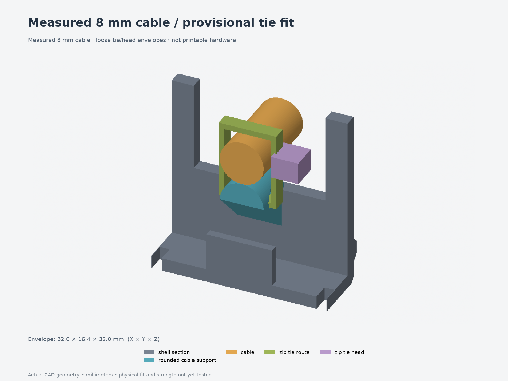

# Revision 010 — measured 8 mm cable

The cable diameter is now **8 mm**, as measured by the user. The existing rounded
support accommodates it without changing any printed part. **All fifteen parts
from revision 009 remain usable; no replacement print is needed for this update.**

The modeled cable center rises from Z23 to Z24 in the print frame, and the loose
tie envelope rises to Z29.3. This leaves **2.7 mm to the lid plane**, compared with
4.7 mm under the previous 6 mm assumption. Zip-tie band/head dimensions and
physical fit remain provisional.

- **[Quick fit print for the 8 mm cable](../../fit-tests/004-8mm-cable/print-layout.3mf)**
  · [test instructions](../../fit-tests/004-8mm-cable/README.md)
- [Cable and tie preview](cable-routing.png) · [lid clearance](cable-closure.png)
- [Assembly STEP](assembly.step) · [individual STEP/3MF](parts/)
- [Parameters](parameters.json) · [source](model.py) · [measurement record](../../measurements/2026-09-11-cable.json)
- [Geometry checks](validation.json) · [8 mm fit/compatibility checks](cable-validation.json) · [FreeCAD checks](freecad-validation.json)

The new test includes the same two printable sections as fit test 003, with the
8 mm measurement and updated preview/checks recorded. If you already printed 003,
use those pieces with the 8 mm cable. The cable and tie shown are clearance
references, not printed hardware. Grip, tie fit and wiring bends still need a
physical check; a diameter measurement does not validate them.

The full enclosure's earlier PCB/button layout is unchanged. Its measured 49 mm
board retention remains in the separate [board-fit test](../../fit-tests/002-board-fit-heatsets/).
Previous revisions and test prints are preserved.
