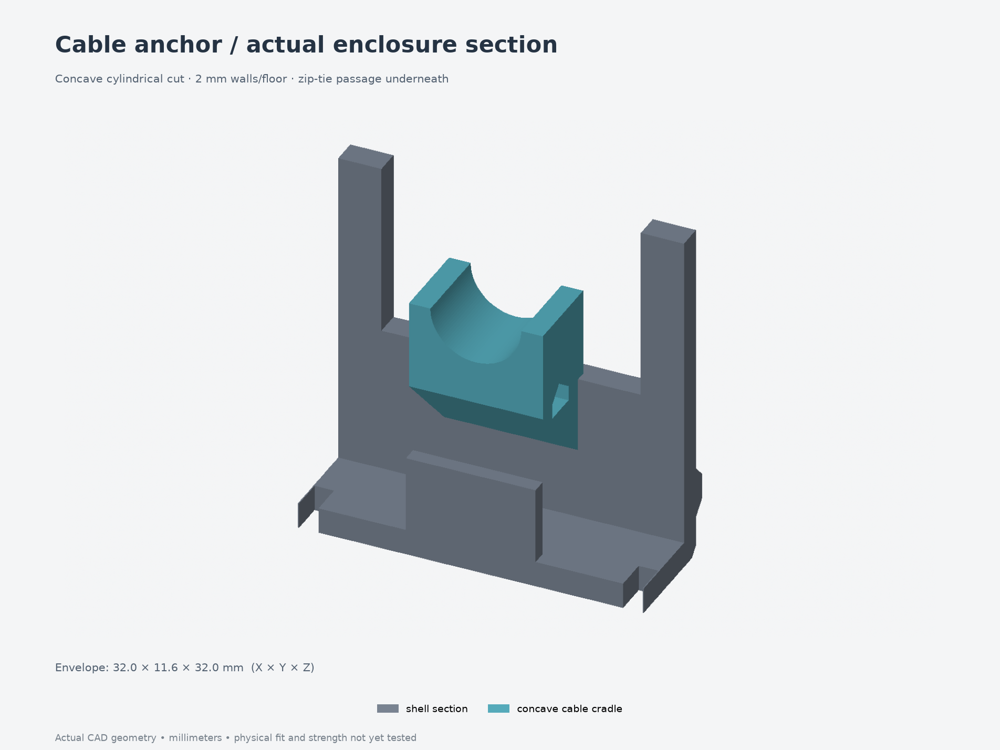

# Revision 011 — narrower enclosure and concave cable cradle

The full enclosure is **3 mm narrower**, as requested after the locking shelves
printed too far apart. Each retention side moves inward **1.5 mm**. The body now
captures the measured **49 × 70 × 1 mm PCB**. A block with a cylindrical cutout
replaces the raised cable support, so the measured **8 mm cable sits in a groove**
and a zip tie holds it down.

**Print the small tests first:**

- [005 — board retention, five-part 3MF](../../fit-tests/005-board-width/print-layout.3mf)
  and [instructions](../../fit-tests/005-board-width/README.md).
- [006 — cable cradle and lid section, two-part 3MF](../../fit-tests/006-cable-cradle/print-layout.3mf)
  and [instructions](../../fit-tests/006-cable-cradle/README.md).

Both use this revision's exact CAD inputs and interfaces. Physical results are
pending. The button linkage still uses the earlier Y layout; integrating the
measured 14 mm switch spacing requires a separate actuator revision. This update
does not establish button alignment with the actual board.

## Replacement parts and dimensions

Replace **body, lid and desk bracket together**. Their widths all reduce by 3 mm;
length, height, wall thickness and fastener sizes stay the same. The four PCB
clamps and eight button parts match revision 010 after translating their print
positions, so those twelve printed pieces can be reused. Bracket/desk screw
positions also move inward 1.5 mm per side: the narrower bracket needs its new
mounting pattern.

| Dimension | Revision 010 | Revision 011 |
| --- | --- | --- |
| Main shell width, excluding belt/ears | 72.8 mm | **69.8 mm** |
| Main cavity width | 68 mm | **65 mm** |
| Overall printed assembly width | 116.8 mm | **113.8 mm** |
| Overall assembly length × height | 95.2 × 39.6 mm | **95.2 × 39.6 mm** |
| PCB substrate | 52 × 70 × 1.6 mm assumption | **49 × 70 × 1 mm measured** |
| Gap between locating shoulders | 52.8 mm | **49.8 mm** |
| Gap between inner shelf faces | 50.4 mm | **47.4 mm** |
| Board capture slot height | 1.8 mm | **1.2 mm** |

The PCB top stays at local Z10 mm, preserving enclosure and button mechanism
heights. Its underside rises to Z9 mm, giving a chosen **6.6 mm solder allowance**
above the floor. This allowance is a placement decision, not a new measurement.
The 52 mm populated ESP32 span remains separate from the substrate; verify actual
component overhang and bare-edge contact with test 005.

## Cable retention

The cradle is an **8 mm long, 12.4 mm wide block** with an **Ø8.4 mm cylindrical
cutout**, leaving **2 mm side walls** and **2 mm material above the tie tunnel**.
The 0.2 mm radial fit allowance is provisional. The cable sits at the bottom of
the groove; its axis is at local Z24 mm. The cylindrical cut axis is Z24.2 mm
because the cable is smaller than the cutout.

The transverse passage is **3.2 mm wide × 1.4 mm straight height**, with a 45°
roof. The underside grows from the end wall with a 45° ramp. A provisional
2.5 × 1 mm tie and 5 × 5 × 4 mm head fit digitally, with the head above the right
shoulder and **2.7 mm clearance to the lid plane**. Thread with the lid open,
seat the cable, then snug the tie; leave slack before the terminals. Standard
ties may need cutting and replacing for removal. Actual tie fit and retention
force have not been established.

## Open and print

- [Body 3MF](parts/body.3mf), [lid 3MF](parts/lid.3mf),
  [desk bracket 3MF](parts/desk_bracket.3mf).
- [Full print-layout 3MF](print-layout.3mf) and [individual STEP/3MF files](parts/).
- [Assembly STEP](assembly.step) opens in Fusion 360 or FreeCAD. Editable
  parametric source is [model.py](model.py) with [parameters.json](parameters.json)
  and its adjacent modules. Native Fusion conversion requires running the
  [Fusion helper](../../fusion/README.md) inside Fusion; no `.f3d` export is claimed here.
- [Cable and tie reference](cable-routing.png), [lid closure](cable-closure.png),
  [interior](interior.png), [under-desk view](under-desk.png), [exploded view](exploded.png).

Print the body floor-down, lid exterior-down and bracket desk-contact-face down.
Unfilled PETG remains the initial material candidate; use the intended final
settings for the tests. Start with supports off for the cradle and corner ribs,
then inspect the ramps/bridges in the slicer. Sliders require local removable
support under their stepped arms. No supports are modeled. These 3MFs contain
geometry in millimeters, without verified printer/filament/process settings.

Hardware remains M3×5 heat sets for the four lid, four PCB-clamp, four bracket and
two contact joints. Use M3×8 lid screws, M3×6 PCB screws, M3×10 bracket screws and
nylon M3×12 contact adjusters with exposed jam nuts. Four cartridge joints remain
M3×4 heat sets with M3×18 screws. **No printed captive-nut pockets remain.**
Insert OD4.6/pilot4.0 mm are provisional; verify your actual inserts. The long
PCB insert-tool approach remains 21.8 mm with a modeled Ø6 mm narrow shaft and
only 0.1 mm nominal side-wall clearance. Test 005 cannot verify that full-height
reach; install inserts before the board/cartridges and check your actual tool.

See [design/check details](design-notes.md), [export validation](validation.json),
[FreeCAD inspection](freecad-validation.json), [width and board-fit checks](width-validation.json),
[cable checks](cable-validation.json) and [mechanism checks](mechanism-validation.json).
Digital validity does not establish physical fit, strength, switch travel or RF behavior.
