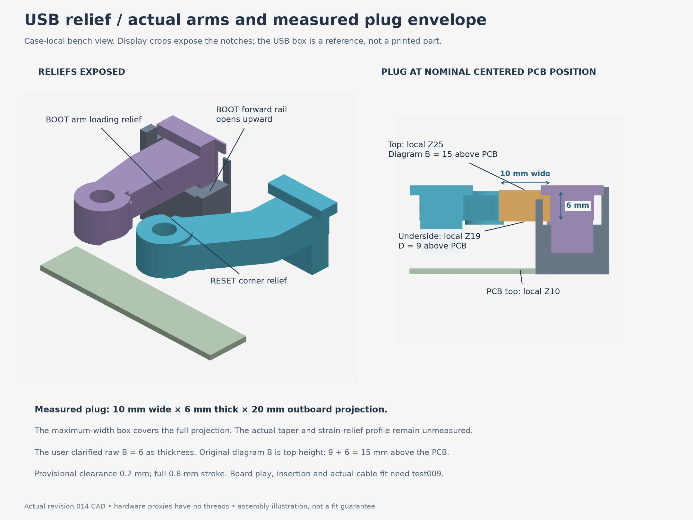

# Revision 014 — measured USB clearance

Both button sliders and the BOOT guide now clear the centered measured USB plug
envelope. The plug is **10 mm wide, 6 mm thick and projects 20 mm past the board's
left edge**. Its underside is **9 mm above the perfboard**, so its top is **15 mm**
above it. Its center is **23 mm from the bottom edge**, and the flexible USB cable
is **Ø3.5 mm**. See the [measurement record](../../measurements/2026-09-13-usb-connector.json).

**[Print these three replacement pieces first](../../fit-tests/009-usb-clearance/replacements-only.3mf)**:
RESET slider, BOOT slider and BOOT frame. Reuse the other twelve printed pieces
from revision 013. Hardware specifications are unchanged: reuse the removable
hardware and fit two M3×5 contact inserts in the new sliders. Follow the
[fit checklist](../../fit-tests/009-usb-clearance/README.md) and
[illustrated assembly guide](../../assembly-guides/014-buttons/README.md).
A [complete open jig](../../fit-tests/009-usb-clearance/print-layout.3mf) is included
if you do not have the prior body or test frame.

## Geometry and reuse

The sliders have open-bottom reliefs that clear the plug during their 0.8 mm
modeled stroke and allow top loading with the plug installed. The BOOT frame's
upper inner rail is relieved upward to avoid a thin lip. Rear guide bearings, magnet pockets, keepers and fasteners retain their geometry.
Stop positions and travel remain unchanged, and the checked overtravel is still
blocked; the BOOT lower-stop contact area is slightly reduced.

The relief uses a conservative rectangular plug box and **0.2 mm clearance**.
It leaves at least **1.285 mm** around the contact insert envelope. A generated
0.25 mm clearance variant leaves at least **1.216 mm**; the model limits this
parameter to 0.20–0.25 mm and enforces a 1.2 mm wall minimum. These geometric
checks do not establish printed strength or a suitable fit for every printer.

Button centers remain RESET 30 mm and BOOT 16 mm from the board bottom, both
3.3 mm from the left edge. Board retention, body, lid, desk bracket and the
8 mm end-cable cradle are unchanged. Overall dimensions remain
**114.3 × 95.2 × 39.6 mm**.

- [RESET slider](parts/reset_slider.3mf), [BOOT slider](parts/boot_slider.3mf), [BOOT frame](parts/boot_frame.3mf).
- [Assembly STEP](assembly.step), [individual STEP/3MF parts](parts/) and [full print layout](print-layout.3mf).
- Editable [model](model.py), [parameters](parameters.json) and adjacent source modules.
- [Interior](interior.png), [mounted view](under-desk.png) and [exploded view](exploded.png).

## Assembly and remaining fit checks

Install heat-set inserts before electronics and magnets. Fit the board, clamps
and USB plug first. Hold the bare button frame against its exterior mounting
pads, lower the loaded slider from above, then fit the rear keeper and mounting
screws. **Do not slide a preassembled cartridge horizontally over the plug**:
the contact boss can cross the connector during that approach. Fit the nylon
contact adjuster from above after checking alignment. The guide explains magnet
polarity and keeper handling.

The measured plug underside clears the adjacent PCB clamp screw head by
**3.8 mm**, superseding revision 013's provisional plug/screw conflict. The
centered maximum-size plug box clears the revised parts and hardware in the
sampled motion and assembly checks.

**Physical fit is pending.** The board can move ±0.65 mm sideways, ±0.4 mm
lengthwise and 0.2 mm vertically. Conservative plug-envelope contacts remain at
placement limits: 144 of 162 sampled combinations per clearance scenario have
contacts, while all centered-XY samples clear. Test both buttons with the actual
connector and board positions; do not force a rubbing part. The plug's taper,
inboard jack/metal geometry and cable bend route are unmeasured. A centered
successful fit does not establish fit throughout the board's available movement.

All hardware is unchanged: M3×5 contact inserts, nylon M3×12 adjusters and nylon
jam nuts; each cartridge attaches with two M3×18 screws into **short M3×4 body
inserts**. Their 4.4 mm blind pilots cannot take the longer inserts. Actual
insert OD, friction, magnetic return and switch height/travel need testing.
Nominal adjuster-head/lid clearance is only 0.4 mm before adjustment.

Use production orientations for the quick print. Sliders require local removable
support under stepped arms; keep bearing, magnet and insert surfaces clean.
The BOOT frame prints on its outer side. PETG remains the initial material
candidate. Geometry 3MFs contain no verified printer/material profile or print-time
estimate. [Board test 007](../../fit-tests/007-board-easier-fit/README.md) and
[cable test 006](../../fit-tests/006-cable-cradle/README.md) remain representative.

See [design and regeneration notes](design-notes.md), [export validation](validation.json),
[independent FreeCAD reopening](freecad-validation.json) and
[USB/mechanism checks](usb-validation.json).
