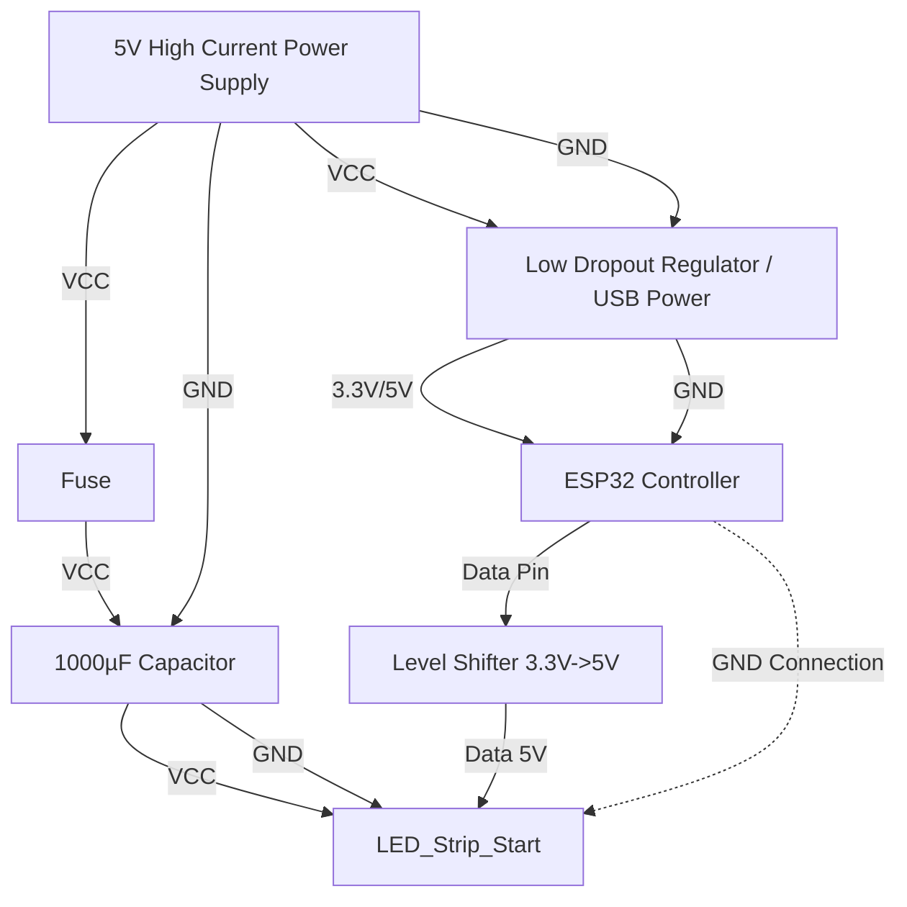

# Hardware Recommendations to Prevent ESP32 Starvation

The crashes you are experiencing when brightness increases are likely due to "Brownouts" or voltage starvation. When the LEDs draw high current, the voltage from the power supply drops. If it drops below ~2.6V (or even ~4.5V if using the 5V pin on some boards), the ESP32 resets.

## 1. Wiring Schema for Stability

To physically guarantee the ESP32 isn't starved, separate the power paths or ensure the supply is robust.

## 2. Key Components

### A. Capacitor (Critical)

Add a large capacitor (**1000µF, 6.3V or higher**) across the `+` and `-` terminals of the power supply, as close to the LED strip and ESP32 as possible. This acts as a reservoir for sudden current spikes (like when the animation flashes).

### B. Power Injection

For 500+ LEDs, power should not just be connected at the start.

- Connect 5V and GND to the **start** of the strip.
- Connect 5V and GND to the **end** of the strip.
- Ideally, inject power every ~100-150 LEDs.
  _Note: Data flows only from start to end, but power can flow from anywhere._

### C. Separate Power Paths

The most robust solution is to isolate the ESP32 power:

1. **LED Power**: A large 5V PSU connected directly to the LEDs.
2. **ESP32 Power**: A separate USB charger or a small Buck Converter stepping down the 5V PSU to a clean 5V/3.3V for the ESP32.
3. **Common Ground**: You **MUST** connect the Ground (GND) of the ESP32 to the Ground of the LEDs.

### D. Logic Level Shifter

While not strictly for power, using a **74AHCT125** level shifter improves signal reliability. If the voltage drops slightly, a 3.3V signal might not be read correctly by 5V LEDs, causing flickering which looks like crashing.

## 3. Power Estimation

- **Software Limit**: We have added a software limit of **2500mA** in `Constants.h`.
- **Hardware Needs**:
  - 560 LEDs x 60mA (white) = 33.6 Amps (Theoretical max)
  - 560 LEDs x 20mA (Rainbow avg) = 11.2 Amps
  - Even at brightness 50 (approx 20%), you might draw 2-3 Amps.
  - Ensure your power supply is rated for at least **4A** or **5A** for stability, even with the software limiter.
